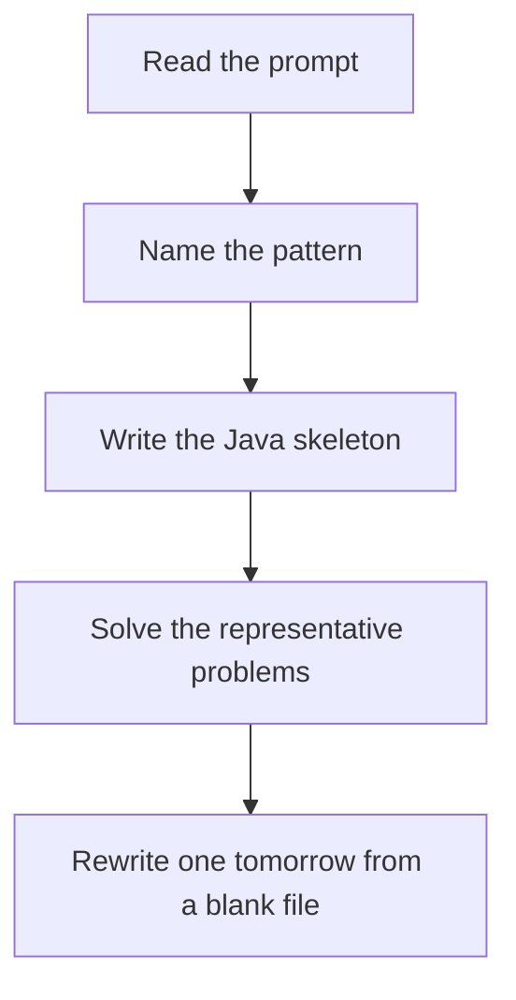

# Hashing / frequency

DSA · 75 min

January. Trade memory for a second pass. Store what you have already seen, then ask the map a yes/no or a count.

## Flow



## How to recognize it

Need a pair, count, or membership in O(1) The array is unsorted and a sort would be extra work You care how many times a value appeared Two of these in the prompt is enough. Say the pattern name out loud, then open the editor.

## The idea

Trade memory for a second pass. Store what you have already seen, then ask the map a yes/no or a count.

## Java template

Type this from memory. Only the condition inside the loop changes between problems in this family.

```text
Map<Integer, Integer> freq = new HashMap<>();
for (int value : nums) {
    freq.merge(value, 1, Integer::sum);
}
```

## Problems that count

Two Sum (Easy). The template. Say the complement out loud before you code.

Group Anagrams (Medium). Key is the sorted word or a 26-count signature.

Longest Consecutive Sequence (Medium). Set lookup. Only start counting at a number with no left neighbor.

## Mistakes that make you blank in the interview

Using a list scan inside the loop and calling it hashing Forgetting that int[] cannot be a HashMap key; use a String or a long encoding Updating the map before checking the complement in Two Sum

## When this sits in the calendar

This is in the January must-set. It belongs in the 75-minute DSA block on weekdays. Do not add a new pattern on a day the previous rewrite failed.

## Play this

1. Name it before coding
2. Write the skeleton from memory
3. Solve the listed problems
4. Blank rewrite the next day

## Steps

- Recognition: Need a pair, count, or membership in O(1) The array is unsorted and a sort would be extra work You care how many times a value appeared
- If you cannot name it in a minute, this is pass 1: read one solution, then code it yourself.
- Pass 2 is the next day, empty file, no video. Pass 3 is day 3, pass 4 is day 7, pass 5 is day 15 to 30.
- Mark the attempt on the Patterns tab. Green means the rewrite worked alone.

## Example

```text
Map<Integer, Integer> freq = new HashMap<>();
for (int value : nums) {
    freq.merge(value, 1, Integer::sum);
}
```

## The usual miss

Using a list scan inside the loop and calling it hashing

## They will ask

Walk Two Sum and say why this pattern fits.

## Before you close the laptop

Rewrite Two Sum tomorrow before any new pattern.
