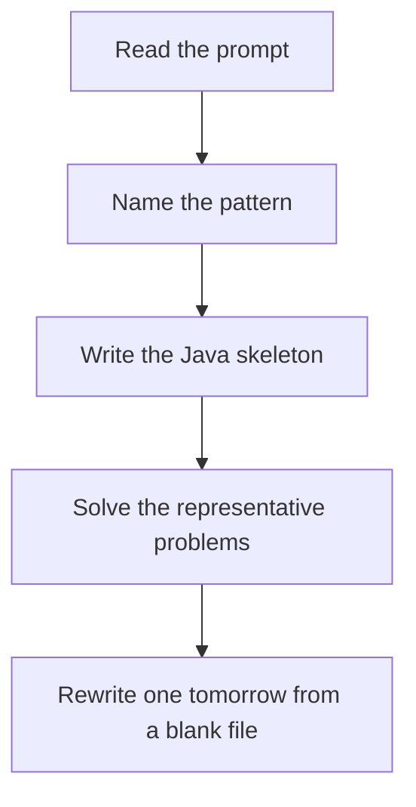

# Heap / priority queue

DSA · 75 min

January. A heap of size K keeps only the candidates that can still win. Java's PriorityQueue is a min-heap; for max-heap pass a reverse comparator.

## Flow



## How to recognize it

Kth largest, top K, merge K sorted, running median You repeatedly need the current min or max Sorting fully is wasted work Two of these in the prompt is enough. Say the pattern name out loud, then open the editor.

## The idea

A heap of size K keeps only the candidates that can still win. Java's PriorityQueue is a min-heap; for max-heap pass a reverse comparator.

## Java template

Type this from memory. Only the condition inside the loop changes between problems in this family.

```text
PriorityQueue<Integer> heap = new PriorityQueue<>();
for (int value : nums) {
    heap.offer(value);
    if (heap.size() > k) heap.poll();
}
return heap.peek();
```

## Problems that count

Kth Largest Element in an Array (Medium). Min-heap of size k. Also know QuickSelect exists.

Top K Frequent Elements (Medium). Frequency map, then a heap of size k. Bucket sort is the follow-up.

Find Median from Data Stream (Hard). Max-heap left, min-heap right.

## Mistakes that make you blank in the interview

Default PriorityQueue treated as a max-heap Kth largest built with a heap of size n. Size K is the point. Median stream: the two heaps must stay balanced, and the max-heap holds the smaller half

## When this sits in the calendar

This is in the January must-set. It belongs in the 75-minute DSA block on weekdays. Do not add a new pattern on a day the previous rewrite failed.

## Play this

1. Name it before coding
2. Write the skeleton from memory
3. Solve the listed problems
4. Blank rewrite the next day

## Steps

- Recognition: Kth largest, top K, merge K sorted, running median You repeatedly need the current min or max Sorting fully is wasted work
- If you cannot name it in a minute, this is pass 1: read one solution, then code it yourself.
- Pass 2 is the next day, empty file, no video. Pass 3 is day 3, pass 4 is day 7, pass 5 is day 15 to 30.
- Mark the attempt on the Patterns tab. Green means the rewrite worked alone.

## Example

```text
PriorityQueue<Integer> heap = new PriorityQueue<>();
for (int value : nums) {
    heap.offer(value);
    if (heap.size() > k) heap.poll();
}
return heap.peek();
```

## The usual miss

Default PriorityQueue treated as a max-heap

## They will ask

Walk Kth Largest Element in an Array and say why this pattern fits.

## Before you close the laptop

Rewrite Kth Largest Element in an Array tomorrow before any new pattern.
