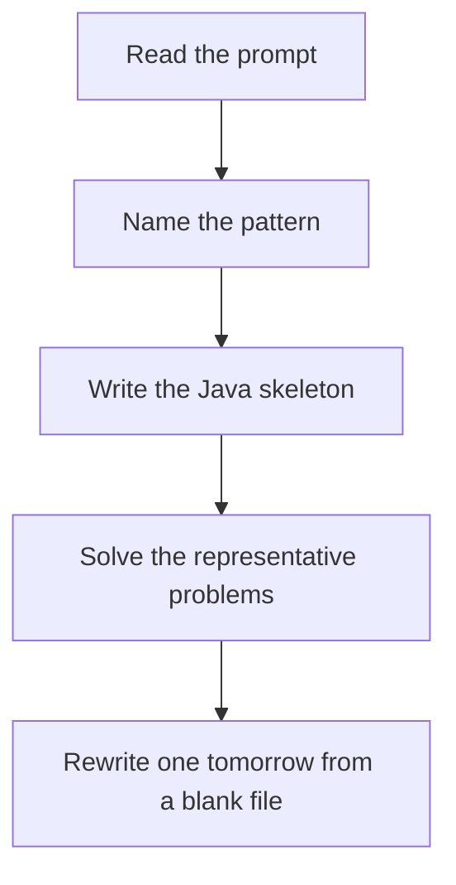

# Intervals

DSA · 75 min

January. Sort. Then one pass: if the current start is after the previous end, they are disjoint. Otherwise extend the end.

## Flow



## How to recognize it

Meetings, ranges, merge, insert, how many overlap Sorting by start or by end changes the question A new interval may swallow several old ones Two of these in the prompt is enough. Say the pattern name out loud, then open the editor.

## The idea

Sort. Then one pass: if the current start is after the previous end, they are disjoint. Otherwise extend the end.

## Java template

Type this from memory. Only the condition inside the loop changes between problems in this family.

```text
Arrays.sort(intervals, Comparator.comparingInt(a -> a[0]));
List<int[]> merged = new ArrayList<>();
for (int[] interval : intervals) {
    if (merged.isEmpty() || merged.get(merged.size() - 1)[1] < interval[0]) {
        merged.add(interval);
    } else {
        merged.get(merged.size() - 1)[1] =
            Math.max(merged.get(merged.size() - 1)[1], interval[1]);
    }
}
```

## Problems that count

Merge Intervals (Medium). Sort by start, extend the last end.

Insert Interval (Medium). Three parts: before, overlapping, after.

Non-overlapping Intervals (Medium). Sort by end. Keep the interval that finishes first.

## Mistakes that make you blank in the interview

Sorting by end for merge, and by start for 'remove minimum to avoid overlap' — they are different Using < when the problem treats touching endpoints as overlap Inserting without considering the new interval sitting in a gap

## When this sits in the calendar

This is in the January must-set. It belongs in the 75-minute DSA block on weekdays. Do not add a new pattern on a day the previous rewrite failed.

## Play this

1. Name it before coding
2. Write the skeleton from memory
3. Solve the listed problems
4. Blank rewrite the next day

## Steps

- Recognition: Meetings, ranges, merge, insert, how many overlap Sorting by start or by end changes the question A new interval may swallow several old ones
- If you cannot name it in a minute, this is pass 1: read one solution, then code it yourself.
- Pass 2 is the next day, empty file, no video. Pass 3 is day 3, pass 4 is day 7, pass 5 is day 15 to 30.
- Mark the attempt on the Patterns tab. Green means the rewrite worked alone.

## Example

```text
Arrays.sort(intervals, Comparator.comparingInt(a -> a[0]));
List<int[]> merged = new ArrayList<>();
for (int[] interval : intervals) {
    if (merged.isEmpty() || merged.get(merged.size() - 1)[1] < interval[0]) {
        merged.add(interval);
    } else {
        merged.get(merged.size() - 1)[1] =
            Math.max(merged.get(merged.size() - 1)[1], interval[1]);
    }
}
```

## The usual miss

Sorting by end for merge, and by start for 'remove minimum to avoid overlap' — they are different

## They will ask

Walk Merge Intervals and say why this pattern fits.

## Before you close the laptop

Rewrite Merge Intervals tomorrow before any new pattern.
