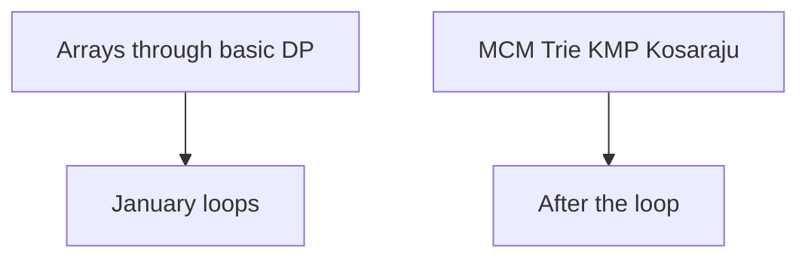

# What January needs, and what waits

DSA · 10 min

By January you can be handed a medium in the core set and start. Advanced string algorithms and exotic graph theorems are not equally important.

## Flow



## Play this

1. Core patterns are the job
2. One DP family done deeply
3. MCM is one problem if time
4. KMP is LPS once

## Steps

- Must: arrays, hash, prefix sums, two pointers, sliding window, binary search, lists, stack, monotonic stack, intervals, greedy, trees, BST, heap, BFS/DFS, topo, Dijkstra, basic DP.
- Later: MCM, trie depth, KMP and Z as a specialty, Kosaraju, bridges, articulation points.
- The live pattern pages cover the must-set with Java templates.

## Example

```text
Basic DP means stairs, robber, grid, subset, coins, one stock shape, one LIS, one LCS. Not every variant.
```

## The usual miss

Spending December on Kosaraju while house robber is shaky.

## They will ask

Name the pattern for a medium in under a minute.

## Before you close the laptop

Open the drill and do ten prompts. The misses are the only new DSA.
