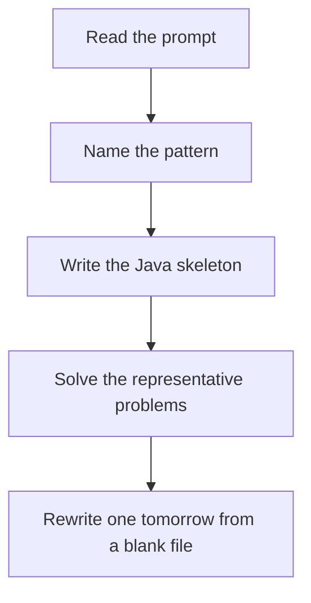

# Knapsack / subset DP

DSA · 75 min

January. 0/1: iterate capacity downward so each item is used once. Unbounded coins: iterate capacity upward so the same coin can be reused.

## Flow



## How to recognize it

Pick or skip each item once Subset sum, partition, coin change, target sum Capacity is the second dimension Two of these in the prompt is enough. Say the pattern name out loud, then open the editor.

## The idea

0/1: iterate capacity downward so each item is used once. Unbounded coins: iterate capacity upward so the same coin can be reused.

## Java template

Type this from memory. Only the condition inside the loop changes between problems in this family.

```text
boolean[] can = new boolean[target + 1];
can[0] = true;
for (int num : nums) {
    for (int sum = target; sum >= num; sum--) {
        can[sum] = can[sum] || can[sum - num];
    }
}
```

## Problems that count

Partition Equal Subset Sum (Medium). 0/1 subset sum to total/2.

Coin Change (Medium). Unbounded. Minimum count. Seed with a large number, not the combination count.

Target Sum (Medium). Same as count of subsets with a derived sum.

## Mistakes that make you blank in the interview

Looping capacity upward on a 0/1 problem and using an item twice Coin Change I (fewest coins) confused with Coin Change II (number of combinations) Partition: forgetting the total must be even, and the target is total/2

## When this sits in the calendar

This is in the January must-set. It belongs in the 75-minute DSA block on weekdays. Do not add a new pattern on a day the previous rewrite failed.

## Play this

1. Name it before coding
2. Write the skeleton from memory
3. Solve the listed problems
4. Blank rewrite the next day

## Steps

- Recognition: Pick or skip each item once Subset sum, partition, coin change, target sum Capacity is the second dimension
- If you cannot name it in a minute, this is pass 1: read one solution, then code it yourself.
- Pass 2 is the next day, empty file, no video. Pass 3 is day 3, pass 4 is day 7, pass 5 is day 15 to 30.
- Mark the attempt on the Patterns tab. Green means the rewrite worked alone.

## Example

```text
boolean[] can = new boolean[target + 1];
can[0] = true;
for (int num : nums) {
    for (int sum = target; sum >= num; sum--) {
        can[sum] = can[sum] || can[sum - num];
    }
}
```

## The usual miss

Looping capacity upward on a 0/1 problem and using an item twice

## They will ask

Walk Partition Equal Subset Sum and say why this pattern fits.

## Before you close the laptop

Rewrite Partition Equal Subset Sum tomorrow before any new pattern.
