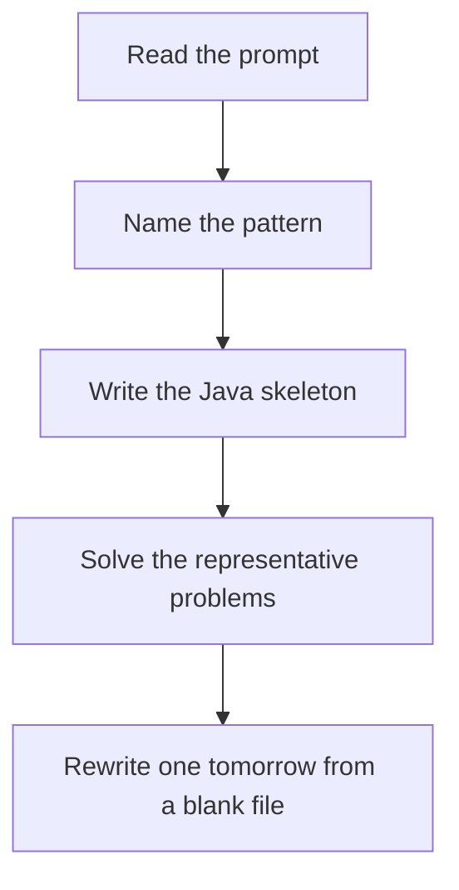

# LCS pattern

DSA · one evening

After the January core is green. If the characters match, take the diagonal plus one. If not, take the better of skipping i or skipping j.

## Flow



## How to recognize it

Two strings, subsequence or substring in common Delete both to equal, shortest common supersequence, distinct subsequences A grid of i versus j Two of these in the prompt is enough. Say the pattern name out loud, then open the editor.

## The idea

If the characters match, take the diagonal plus one. If not, take the better of skipping i or skipping j.

## Java template

Type this from memory. Only the condition inside the loop changes between problems in this family.

```text
int[][] dp = new int[m + 1][n + 1];
for (int i = 1; i <= m; i++) {
    for (int j = 1; j <= n; j++) {
        if (a.charAt(i - 1) == b.charAt(j - 1)) dp[i][j] = dp[i - 1][j - 1] + 1;
        else dp[i][j] = Math.max(dp[i - 1][j], dp[i][j - 1]);
    }
}
```

## Problems that count

Longest Common Subsequence (Medium). The table above. Rebuild one string on paper.

Delete Operation for Two Strings (Medium). m + n - 2 * LCS.

Shortest Common Supersequence (Hard). Walk the LCS table and append the characters you skipped.

## Mistakes that make you blank in the interview

Subsequence vs substring. Substring cannot skip in the middle; the streak resets. Indexing dp[i][j] against charAt(i) instead of charAt(i - 1) Shortest common supersequence is m + n - LCS, but rebuilding the string needs the table

## When this sits in the calendar

Do this only after the January patterns rewrite cleanly. One evening, one problem. It is not equal in weight to sliding window or basic DP.

## Play this

1. Name it before coding
2. Write the skeleton from memory
3. Solve the listed problems
4. Blank rewrite the next day

## Steps

- Recognition: Two strings, subsequence or substring in common Delete both to equal, shortest common supersequence, distinct subsequences A grid of i versus j
- If you cannot name it in a minute, this is pass 1: read one solution, then code it yourself.
- Pass 2 is the next day, empty file, no video. Pass 3 is day 3, pass 4 is day 7, pass 5 is day 15 to 30.
- Mark the attempt on the Patterns tab. Green means the rewrite worked alone.

## Example

```text
int[][] dp = new int[m + 1][n + 1];
for (int i = 1; i <= m; i++) {
    for (int j = 1; j <= n; j++) {
        if (a.charAt(i - 1) == b.charAt(j - 1)) dp[i][j] = dp[i - 1][j - 1] + 1;
        else dp[i][j] = Math.max(dp[i - 1][j], dp[i][j - 1]);
    }
}
```

## The usual miss

Subsequence vs substring. Substring cannot skip in the middle; the streak resets.

## They will ask

Walk Longest Common Subsequence and say why this pattern fits.

## Before you close the laptop

Rewrite Longest Common Subsequence tomorrow before any new pattern.
