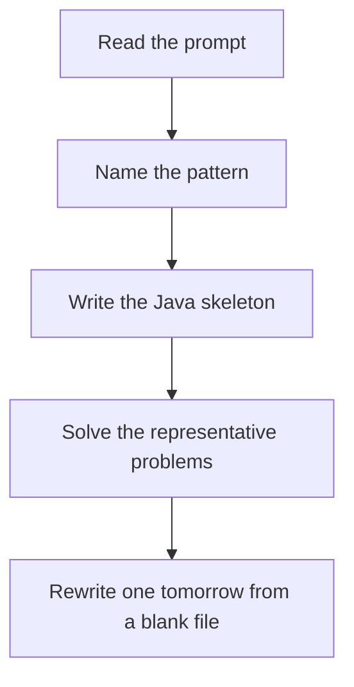

# LIS pattern

DSA · one evening

After the January core is green. O(n^2): dp[i] is the best chain ending at i. O(n log n): tails[len] is the smallest tail of an increasing subsequence of that length.

## Flow



## How to recognize it

Longest increasing subsequence, not subarray Russian dolls, divisible subset, maximum height stack of boxes Patience sorting / binary search on tails for O(n log n) Two of these in the prompt is enough. Say the pattern name out loud, then open the editor.

## The idea

O(n^2): dp[i] is the best chain ending at i. O(n log n): tails[len] is the smallest tail of an increasing subsequence of that length.

## Java template

Type this from memory. Only the condition inside the loop changes between problems in this family.

```text
int[] tails = new int[n];
int len = 0;
for (int value : nums) {
    int i = Arrays.binarySearch(tails, 0, len, value);
    if (i < 0) i = -(i + 1);
    tails[i] = value;
    if (i == len) len++;
}
```

## Problems that count

Longest Increasing Subsequence (Medium). Write O(n^2) first. Then the tails array.

Largest Divisible Subset (Medium). Sort, then predecessor links so you can rebuild the subset.

Number of Longest Increasing Subsequence (Medium). Store length and count ending at i.

## Mistakes that make you blank in the interview

Sorting when the order of the original array matters. LIS is not 'sort then count'. binarySearch insertion point handled wrong on negative results Divisible subset: sort first, then it becomes LIS with a divisibility check

## When this sits in the calendar

Do this only after the January patterns rewrite cleanly. One evening, one problem. It is not equal in weight to sliding window or basic DP.

## Play this

1. Name it before coding
2. Write the skeleton from memory
3. Solve the listed problems
4. Blank rewrite the next day

## Steps

- Recognition: Longest increasing subsequence, not subarray Russian dolls, divisible subset, maximum height stack of boxes Patience sorting / binary search on tails for O(n log n)
- If you cannot name it in a minute, this is pass 1: read one solution, then code it yourself.
- Pass 2 is the next day, empty file, no video. Pass 3 is day 3, pass 4 is day 7, pass 5 is day 15 to 30.
- Mark the attempt on the Patterns tab. Green means the rewrite worked alone.

## Example

```text
int[] tails = new int[n];
int len = 0;
for (int value : nums) {
    int i = Arrays.binarySearch(tails, 0, len, value);
    if (i < 0) i = -(i + 1);
    tails[i] = value;
    if (i == len) len++;
}
```

## The usual miss

Sorting when the order of the original array matters. LIS is not 'sort then count'.

## They will ask

Walk Longest Increasing Subsequence and say why this pattern fits.

## Before you close the laptop

Rewrite Longest Increasing Subsequence tomorrow before any new pattern.
