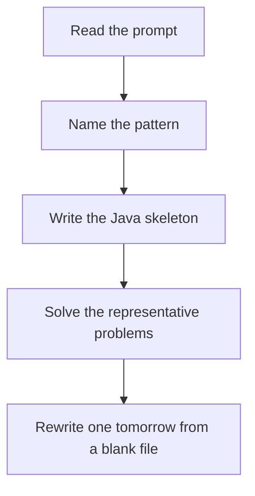

# Matrix traversal

DSA · 75 min

January. Name the boundaries: top, bottom, left, right. Move along one edge, then contract that boundary.

## Flow



## How to recognize it

Grid, layers, diagonals, or in-place rotation Boundaries shrink as you walk You must visit every cell once in a defined order Two of these in the prompt is enough. Say the pattern name out loud, then open the editor.

## The idea

Name the boundaries: top, bottom, left, right. Move along one edge, then contract that boundary.

## Java template

Type this from memory. Only the condition inside the loop changes between problems in this family.

```text
int top = 0, bottom = m - 1, left = 0, right = n - 1;
while (top <= bottom && left <= right) {
    // walk right, down, left, up
    top++; bottom--; left++; right--;
}
```

## Problems that count

Spiral Matrix (Medium). Four directions, shrink bounds.

Rotate Image (Medium). Transpose, then reverse each row. Or cycle four cells.

Set Matrix Zeroes (Medium). First row and column as markers. Watch the corner cell.

## Mistakes that make you blank in the interview

Walking a side after the boundary already collapsed, duplicating cells Rotating by creating a second matrix when the question wants layers of 4-cycles Mixing this with island DFS. Islands are a graph, not a spiral.

## When this sits in the calendar

This is in the January must-set. It belongs in the 75-minute DSA block on weekdays. Do not add a new pattern on a day the previous rewrite failed.

## Play this

1. Name it before coding
2. Write the skeleton from memory
3. Solve the listed problems
4. Blank rewrite the next day

## Steps

- Recognition: Grid, layers, diagonals, or in-place rotation Boundaries shrink as you walk You must visit every cell once in a defined order
- If you cannot name it in a minute, this is pass 1: read one solution, then code it yourself.
- Pass 2 is the next day, empty file, no video. Pass 3 is day 3, pass 4 is day 7, pass 5 is day 15 to 30.
- Mark the attempt on the Patterns tab. Green means the rewrite worked alone.

## Example

```text
int top = 0, bottom = m - 1, left = 0, right = n - 1;
while (top <= bottom && left <= right) {
    // walk right, down, left, up
    top++; bottom--; left++; right--;
}
```

## The usual miss

Walking a side after the boundary already collapsed, duplicating cells

## They will ask

Walk Spiral Matrix and say why this pattern fits.

## Before you close the laptop

Rewrite Spiral Matrix tomorrow before any new pattern.
