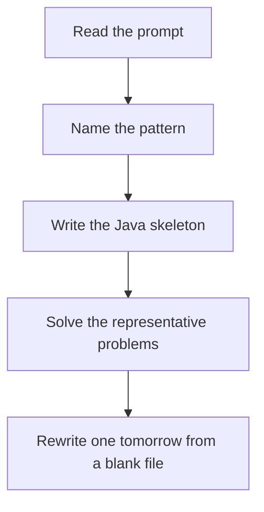

# MCM / partition DP

DSA · one evening

After January. dp[i][j] is the best way to solve the slice i..j. Try every split. Fill short slices before long ones.

## Flow



## How to recognize it

Burst balloons, matrix chain, palindrome partitioning cost You split an array at every k between i and j and combine the two sides The interval length grows from small to large Two of these in the prompt is enough. Say the pattern name out loud, then open the editor.

## The idea

dp[i][j] is the best way to solve the slice i..j. Try every split. Fill short slices before long ones.

## Java template

Type this from memory. Only the condition inside the loop changes between problems in this family.

```text
for (int len = 2; len <= n; len++) {
    for (int i = 0; i + len - 1 < n; i++) {
        int j = i + len - 1;
        for (int k = i; k < j; k++) {
            dp[i][j] = Math.min(dp[i][j], dp[i][k] + dp[k + 1][j] + cost(i, k, j));
        }
    }
}
```

## Problems that count

Burst Balloons (Hard). The one to blank-rewrite. Coins on the ends are 1.

Palindrome Partitioning II (Hard). Minimum cuts. Precompute which slices are palindromes.

Matrix Chain Multiplication (Hard). Not a LeetCode staple. If time is gone, skip and keep Burst Balloons sharp.

## Mistakes that make you blank in the interview

Filling the table by row before shorter lengths exist Burst balloons: forgetting the padded 1s on both ends, so the last balloon has no neighbors Trying to master five MCM problems. One blank rewrite of Burst Balloons is the goal.

## When this sits in the calendar

Leave this until after January interviews are underway. MCM, trie depth, KMP, Z, and the exotic graph algorithms are real, and they are the wrong use of December.

## Play this

1. Name it before coding
2. Write the skeleton from memory
3. Solve the listed problems
4. Blank rewrite the next day

## Steps

- Recognition: Burst balloons, matrix chain, palindrome partitioning cost You split an array at every k between i and j and combine the two sides The interval length grows from small to large
- If you cannot name it in a minute, this is pass 1: read one solution, then code it yourself.
- Pass 2 is the next day, empty file, no video. Pass 3 is day 3, pass 4 is day 7, pass 5 is day 15 to 30.
- Mark the attempt on the Patterns tab. Green means the rewrite worked alone.

## Example

```text
for (int len = 2; len <= n; len++) {
    for (int i = 0; i + len - 1 < n; i++) {
        int j = i + len - 1;
        for (int k = i; k < j; k++) {
            dp[i][j] = Math.min(dp[i][j], dp[i][k] + dp[k + 1][j] + cost(i, k, j));
        }
    }
}
```

## The usual miss

Filling the table by row before shorter lengths exist

## They will ask

Walk Burst Balloons and say why this pattern fits.

## Before you close the laptop

Rewrite Burst Balloons tomorrow before any new pattern.
