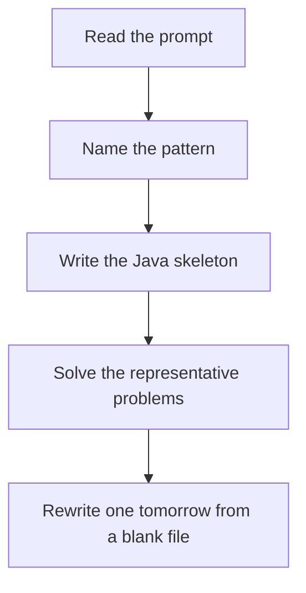

# Merge pattern

DSA · 75 min

January. Look only at the current head of each sequence. Take the smaller, advance that sequence. A dummy node is the stitch point for lists. A heap is the same idea when there are K lists.

## Flow



## How to recognize it

Two or more sequences that are already sorted You need one sorted sequence, or the next smallest head Linked lists or arrays, the comparison is the same Two of these in the prompt is enough. Say the pattern name out loud, then open the editor.

## The idea

Look only at the current head of each sequence. Take the smaller, advance that sequence. A dummy node is the stitch point for lists. A heap is the same idea when there are K lists.

## Java template

Type this from memory. Only the condition inside the loop changes between problems in this family.

```text
ListNode dummy = new ListNode(0);
ListNode tail = dummy;
while (a != null && b != null) {
    if (a.val <= b.val) { tail.next = a; a = a.next; }
    else { tail.next = b; b = b.next; }
    tail = tail.next;
}
tail.next = (a != null) ? a : b;
return dummy.next;
```

## Problems that count

Merge Two Sorted Lists (Easy). Dummy node. This is the skeleton.

Merge Sorted Array (Easy). Write from the end so you do not overwrite values you still need.

Merge k Sorted Lists (Hard). Priority queue of the current head of each list.

## Mistakes that make you blank in the interview

Sorting again after the inputs are already sorted Forgetting to append the leftover list Using a heap of every node instead of a heap of K heads

## When this sits in the calendar

This is in the January must-set. It belongs in the 75-minute DSA block on weekdays. Do not add a new pattern on a day the previous rewrite failed.

## Play this

1. Name it before coding
2. Write the skeleton from memory
3. Solve the listed problems
4. Blank rewrite the next day

## Steps

- Recognition: Two or more sequences that are already sorted You need one sorted sequence, or the next smallest head Linked lists or arrays, the comparison is the same
- If you cannot name it in a minute, this is pass 1: read one solution, then code it yourself.
- Pass 2 is the next day, empty file, no video. Pass 3 is day 3, pass 4 is day 7, pass 5 is day 15 to 30.
- Mark the attempt on the Patterns tab. Green means the rewrite worked alone.

## Example

```text
ListNode dummy = new ListNode(0);
ListNode tail = dummy;
while (a != null && b != null) {
    if (a.val <= b.val) { tail.next = a; a = a.next; }
    else { tail.next = b; b = b.next; }
    tail = tail.next;
}
tail.next = (a != null) ? a : b;
return dummy.next;
```

## The usual miss

Sorting again after the inputs are already sorted

## They will ask

Walk Merge Two Sorted Lists and say why this pattern fits.

## Before you close the laptop

Rewrite Merge Two Sorted Lists tomorrow before any new pattern.
