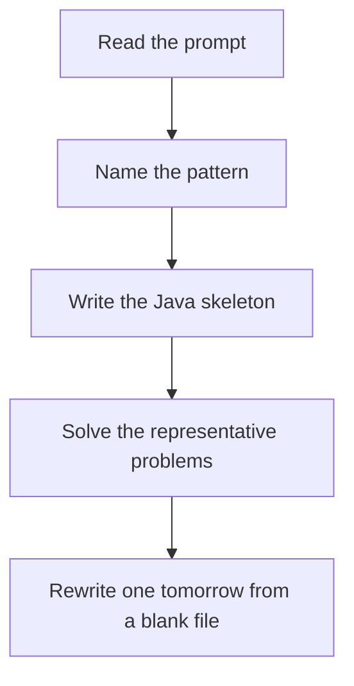

# Monotonic stack

DSA · 75 min

January. Keep indexes whose values are still waiting for a greater element, in increasing or decreasing order. When the new value beats the top, that top has found its answer.

## Flow



## How to recognize it

Next greater, next smaller, previous greater Stock span, daily temperatures, histogram, trapping rain You would otherwise scan left or right for every index Two of these in the prompt is enough. Say the pattern name out loud, then open the editor.

## The idea

Keep indexes whose values are still waiting for a greater element, in increasing or decreasing order. When the new value beats the top, that top has found its answer.

## Java template

Type this from memory. Only the condition inside the loop changes between problems in this family.

```text
Deque<Integer> stack = new ArrayDeque<>();
for (int i = 0; i < n; i++) {
    while (!stack.isEmpty() && nums[stack.peek()] < nums[i]) {
        int j = stack.pop();
        answer[j] = nums[i];
    }
    stack.push(i);
}
```

## Problems that count

Daily Temperatures (Medium). Next warmer day. Store indexes.

Next Greater Element I (Easy). Same loop, then a map from value to answer.

Largest Rectangle in Histogram (Hard). Next and previous smaller. Width is between them.

## Mistakes that make you blank in the interview

Storing values when you needed indexes for distance Increasing vs decreasing chosen by habit, not by the question Histogram: forgetting a sentinel 0 so the stack drains

## When this sits in the calendar

This is in the January must-set. It belongs in the 75-minute DSA block on weekdays. Do not add a new pattern on a day the previous rewrite failed.

## Play this

1. Name it before coding
2. Write the skeleton from memory
3. Solve the listed problems
4. Blank rewrite the next day

## Steps

- Recognition: Next greater, next smaller, previous greater Stock span, daily temperatures, histogram, trapping rain You would otherwise scan left or right for every index
- If you cannot name it in a minute, this is pass 1: read one solution, then code it yourself.
- Pass 2 is the next day, empty file, no video. Pass 3 is day 3, pass 4 is day 7, pass 5 is day 15 to 30.
- Mark the attempt on the Patterns tab. Green means the rewrite worked alone.

## Example

```text
Deque<Integer> stack = new ArrayDeque<>();
for (int i = 0; i < n; i++) {
    while (!stack.isEmpty() && nums[stack.peek()] < nums[i]) {
        int j = stack.pop();
        answer[j] = nums[i];
    }
    stack.push(i);
}
```

## The usual miss

Storing values when you needed indexes for distance

## They will ask

Walk Daily Temperatures and say why this pattern fits.

## Before you close the laptop

Rewrite Daily Temperatures tomorrow before any new pattern.
