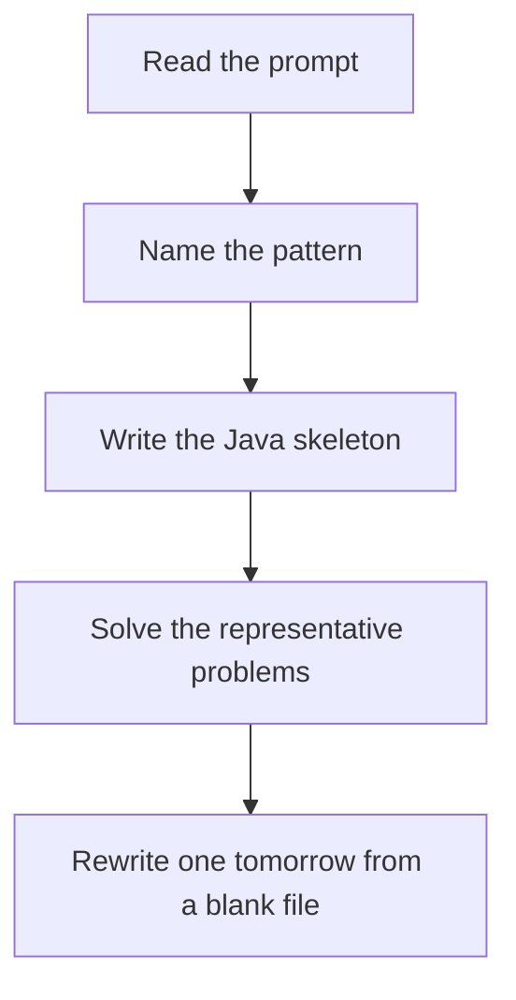

# Minimum spanning tree

DSA · one evening

After the January core is green. Kruskal is 'sort edges, add if DSU says the endpoints are still disconnected'. Stop after n-1 edges.

## Flow



## How to recognize it

Connect all points at minimum cost No cycles in the chosen edges, and every node ends up connected Kruskal sorts edges. Prim grows a frontier. Two of these in the prompt is enough. Say the pattern name out loud, then open the editor.

## The idea

Kruskal is 'sort edges, add if DSU says the endpoints are still disconnected'. Stop after n-1 edges.

## Java template

Type this from memory. Only the condition inside the loop changes between problems in this family.

```text
Arrays.sort(edges, Comparator.comparingInt(e -> e[2]));
int cost = 0, used = 0;
for (int[] edge : edges) {
    if (union(edge[0], edge[1])) {
        cost += edge[2];
        if (++used == n - 1) break;
    }
}
```

## Problems that count

Min Cost to Connect All Points (Medium). Manhattan distance edges. Kruskal or Prim.

Connecting Cities With Minimum Cost (Medium). Premium. If locked, re-implement Kruskal on a handwritten edge list until the DSU check is boring.

Optimize Water Distribution (Hard). Add a virtual well node. Still Kruskal.

## Mistakes that make you blank in the interview

Adding an edge inside a component and calling it a tree Prim's decrease-key faked badly and visiting a node twice without a visited set Confusing MST with shortest path. Dijkstra does not build an MST in general.

## When this sits in the calendar

Do this only after the January patterns rewrite cleanly. One evening, one problem. It is not equal in weight to sliding window or basic DP.

## Play this

1. Name it before coding
2. Write the skeleton from memory
3. Solve the listed problems
4. Blank rewrite the next day

## Steps

- Recognition: Connect all points at minimum cost No cycles in the chosen edges, and every node ends up connected Kruskal sorts edges. Prim grows a frontier.
- If you cannot name it in a minute, this is pass 1: read one solution, then code it yourself.
- Pass 2 is the next day, empty file, no video. Pass 3 is day 3, pass 4 is day 7, pass 5 is day 15 to 30.
- Mark the attempt on the Patterns tab. Green means the rewrite worked alone.

## Example

```text
Arrays.sort(edges, Comparator.comparingInt(e -> e[2]));
int cost = 0, used = 0;
for (int[] edge : edges) {
    if (union(edge[0], edge[1])) {
        cost += edge[2];
        if (++used == n - 1) break;
    }
}
```

## The usual miss

Adding an edge inside a component and calling it a tree

## They will ask

Walk Min Cost to Connect All Points and say why this pattern fits.

## Before you close the laptop

Rewrite Min Cost to Connect All Points tomorrow before any new pattern.
