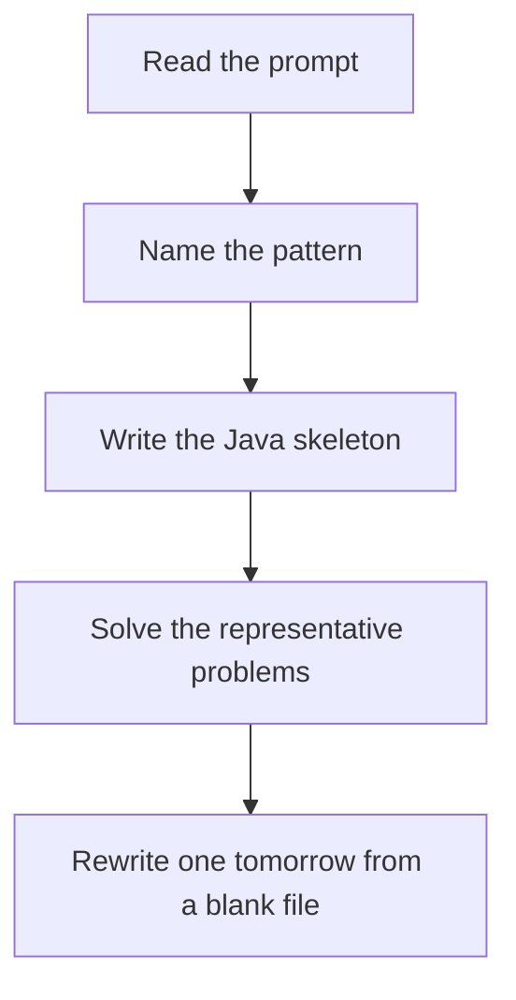

# Prefix sum + HashMap

DSA · 75 min

January. prefix[j] - prefix[i] = k means you have seen prefix[j] - k before. Store earlier prefixes.

## Flow



## How to recognize it

Subarray sum, count of subarrays, or longest subarray with a property The property is about a range, not a single element Brute force is O(n^2) over every i..j Two of these in the prompt is enough. Say the pattern name out loud, then open the editor.

## The idea

prefix[j] - prefix[i] = k means you have seen prefix[j] - k before. Store earlier prefixes.

## Java template

Type this from memory. Only the condition inside the loop changes between problems in this family.

```text
Map<Integer, Integer> seen = new HashMap<>();
seen.put(0, 1);
int prefix = 0;
for (int value : nums) {
    prefix += value;
    // query seen.get(prefix - k) before inserting prefix
}
```

## Problems that count

Subarray Sum Equals K (Medium). Count version. seen stores frequency.

Contiguous Array (Medium). Treat 0 as -1. Longest subarray with sum 0.

Subarray Sums Divisible by K (Medium). Store prefix mod k. In Java, fix negative mods.

## Mistakes that make you blank in the interview

Putting the current prefix into the map before the query Forgetting the empty prefix 0 Using this on an unsorted pair problem that is just Two Sum

## When this sits in the calendar

This is in the January must-set. It belongs in the 75-minute DSA block on weekdays. Do not add a new pattern on a day the previous rewrite failed.

## Play this

1. Name it before coding
2. Write the skeleton from memory
3. Solve the listed problems
4. Blank rewrite the next day

## Steps

- Recognition: Subarray sum, count of subarrays, or longest subarray with a property The property is about a range, not a single element Brute force is O(n^2) over every i..j
- If you cannot name it in a minute, this is pass 1: read one solution, then code it yourself.
- Pass 2 is the next day, empty file, no video. Pass 3 is day 3, pass 4 is day 7, pass 5 is day 15 to 30.
- Mark the attempt on the Patterns tab. Green means the rewrite worked alone.

## Example

```text
Map<Integer, Integer> seen = new HashMap<>();
seen.put(0, 1);
int prefix = 0;
for (int value : nums) {
    prefix += value;
    // query seen.get(prefix - k) before inserting prefix
}
```

## The usual miss

Putting the current prefix into the map before the query

## They will ask

Walk Subarray Sum Equals K and say why this pattern fits.

## Before you close the laptop

Rewrite Subarray Sum Equals K tomorrow before any new pattern.
