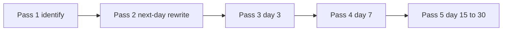

# Five passes, or it did not happen

DSA · 15 min

You have forgotten solved problems because you never had to retrieve them. The pass is the study. The checklist’s 342 rows are variations of about 40 shapes. Master the shape, then 120 to 150 representatives, not every row.

## Flow



## Play this

1. Name the pattern first
2. Close the video
3. Rewrite on an empty file
4. Red comes back sooner

## Steps

- Pass 1: if you cannot name the pattern, read the lecture, then code.
- Pass 2 the next day with no video.
- The Patterns page stores the mark and the next date: day 1, 3, 7, 15, 30.
- Sliding window’s many checklist titles are one loop. Expand, update, shrink, answer.

## Example

```text
Green: solved alone. Yellow: hint. Red: solution. Blue: pattern yes, code no.
```

## The usual miss

A tick mark the night you watched the editorial.

## They will ask

Which pass is this problem on?

## Before you close the laptop

Pick one red problem and schedule only its rewrite tonight.
