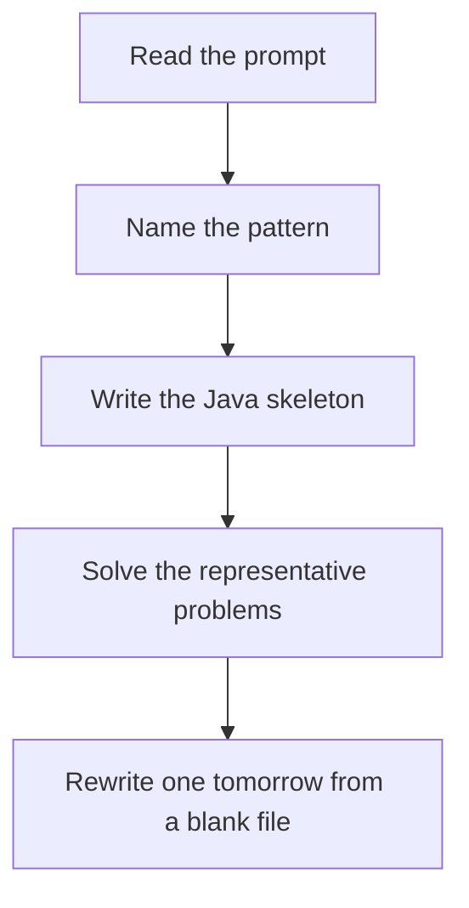

# Linked list reversal

DSA · 75 min

January. Three pointers. Point current back to previous before you lose the rest of the list.

## Flow



## How to recognize it

Reverse a whole list, k nodes, or the second half Palindrome list, reorder list You need previous, current, next Two of these in the prompt is enough. Say the pattern name out loud, then open the editor.

## The idea

Three pointers. Point current back to previous before you lose the rest of the list.

## Java template

Type this from memory. Only the condition inside the loop changes between problems in this family.

```text
ListNode prev = null;
ListNode curr = head;
while (curr != null) {
    ListNode next = curr.next;
    curr.next = prev;
    prev = curr;
    curr = next;
}
return prev;
```

## Problems that count

Reverse Linked List (Easy). Write it until the three lines are automatic.

Reverse Nodes in k-Group (Hard). Count k, reverse that segment, stitch, leave a short tail.

Palindrome Linked List (Easy). Middle, reverse second half, compare, restore if you care.

## Mistakes that make you blank in the interview

Losing curr.next before saving it In k-group, reversing a leftover group shorter than k Checking palindrome by copying into an ArrayList and calling it done. Reverse the second half.

## When this sits in the calendar

This is in the January must-set. It belongs in the 75-minute DSA block on weekdays. Do not add a new pattern on a day the previous rewrite failed.

## Play this

1. Name it before coding
2. Write the skeleton from memory
3. Solve the listed problems
4. Blank rewrite the next day

## Steps

- Recognition: Reverse a whole list, k nodes, or the second half Palindrome list, reorder list You need previous, current, next
- If you cannot name it in a minute, this is pass 1: read one solution, then code it yourself.
- Pass 2 is the next day, empty file, no video. Pass 3 is day 3, pass 4 is day 7, pass 5 is day 15 to 30.
- Mark the attempt on the Patterns tab. Green means the rewrite worked alone.

## Example

```text
ListNode prev = null;
ListNode curr = head;
while (curr != null) {
    ListNode next = curr.next;
    curr.next = prev;
    prev = curr;
    curr = next;
}
return prev;
```

## The usual miss

Losing curr.next before saving it

## They will ask

Walk Reverse Linked List and say why this pattern fits.

## Before you close the laptop

Rewrite Reverse Linked List tomorrow before any new pattern.
