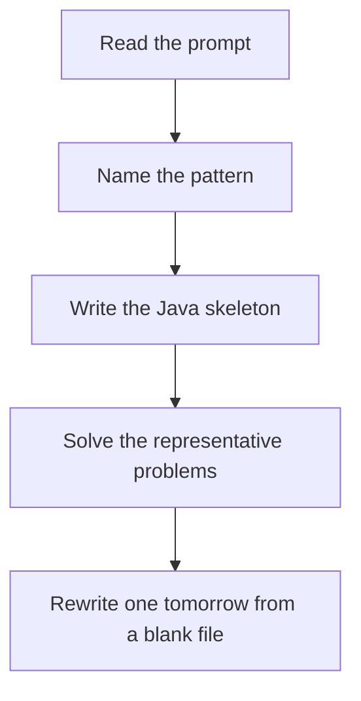

# Shortest path

DSA · 75 min

January. Do not Dijkstra an unweighted maze. The algorithm follows the constraint. Dijkstra's heap pops the next closest settled node.

## Flow



## How to recognize it

Unweighted: BFS. Non-negative weights: Dijkstra. Negative edges: Bellman-Ford. All pairs: Floyd-Warshall A grid with cost, a network delay, flights with at most K stops Two of these in the prompt is enough. Say the pattern name out loud, then open the editor.

## The idea

Do not Dijkstra an unweighted maze. The algorithm follows the constraint. Dijkstra's heap pops the next closest settled node.

## Java template

Type this from memory. Only the condition inside the loop changes between problems in this family.

```text
PriorityQueue<int[]> heap = new PriorityQueue<>(Comparator.comparingInt(a -> a[0]));
int[] dist = new int[n];
Arrays.fill(dist, Integer.MAX_VALUE);
dist[src] = 0;
heap.offer(new int[] {0, src});
while (!heap.isEmpty()) {
    int[] cur = heap.poll();
    if (cur[0] != dist[cur[1]]) continue;
    // relax edges
}
```

## Problems that count

Shortest Path in Binary Matrix (Medium). Unweighted. BFS, 8 directions.

Network Delay Time (Medium). Dijkstra. Answer is the max distance if every node is reached.

Cheapest Flights Within K Stops (Medium). Bellman-Ford limited to K+1 edges, or Dijkstra state (node, stops).

## Mistakes that make you blank in the interview

Missing the stale-heap check, so you relax outdated distances Bellman-Ford run |V| times and forgetting the extra pass only detects a negative cycle Floyd-Warshall k loop outside i, j. The order is k, then i, then j.

## When this sits in the calendar

This is in the January must-set. It belongs in the 75-minute DSA block on weekdays. Do not add a new pattern on a day the previous rewrite failed.

## Play this

1. Name it before coding
2. Write the skeleton from memory
3. Solve the listed problems
4. Blank rewrite the next day

## Steps

- Recognition: Unweighted: BFS. Non-negative weights: Dijkstra. Negative edges: Bellman-Ford. All pairs: Floyd-Warshall A grid with cost, a network delay, flights with at most K stops
- If you cannot name it in a minute, this is pass 1: read one solution, then code it yourself.
- Pass 2 is the next day, empty file, no video. Pass 3 is day 3, pass 4 is day 7, pass 5 is day 15 to 30.
- Mark the attempt on the Patterns tab. Green means the rewrite worked alone.

## Example

```text
PriorityQueue<int[]> heap = new PriorityQueue<>(Comparator.comparingInt(a -> a[0]));
int[] dist = new int[n];
Arrays.fill(dist, Integer.MAX_VALUE);
dist[src] = 0;
heap.offer(new int[] {0, src});
while (!heap.isEmpty()) {
    int[] cur = heap.poll();
    if (cur[0] != dist[cur[1]]) continue;
    // relax edges
}
```

## The usual miss

Missing the stale-heap check, so you relax outdated distances

## They will ask

Walk Shortest Path in Binary Matrix and say why this pattern fits.

## Before you close the laptop

Rewrite Shortest Path in Binary Matrix tomorrow before any new pattern.
