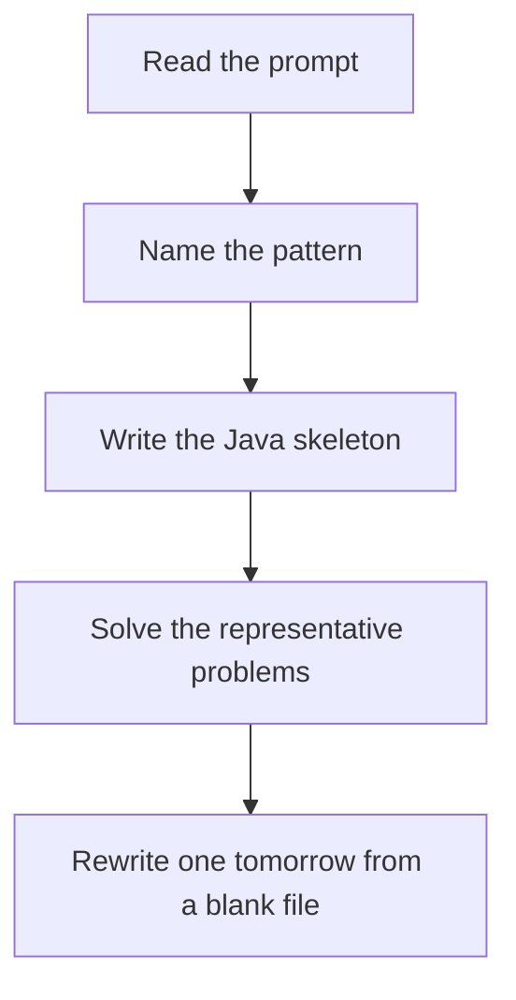

# Sieve and factors

DSA · one evening

After January. Cross off multiples. Start marking from p*p, step by p. Smallest prime factor lets you factor in log time afterwards.

## Flow



## How to recognize it

Many primality checks, not one Count primes under n, smallest prime factor, factorization of every number in a range Two of these in the prompt is enough. Say the pattern name out loud, then open the editor.

## The idea

Cross off multiples. Start marking from p*p, step by p. Smallest prime factor lets you factor in log time afterwards.

## Java template

Type this from memory. Only the condition inside the loop changes between problems in this family.

```text
boolean[] composite = new boolean[n];
for (int p = 2; p * p < n; p++) {
    if (composite[p]) continue;
    for (int m = p * p; m < n; m += p) composite[m] = true;
}
```

## Problems that count

Count Primes (Medium). Sieve of Eratosthenes.

Smallest Prime Factor practice (Easy). Not one famous prompt. Build spf[1..n] and factor 12 numbers by hand with it.

Factorial Trailing Zeroes (Medium). Count factors of 5. This is the math question that actually shows up.

## Mistakes that make you blank in the interview

Trial dividing every number up to n when one sieve would do p * p overflowing int. Cast to long. Spending a week on math. Two problems, then back to DP or the project.

## When this sits in the calendar

Leave this until after January interviews are underway. MCM, trie depth, KMP, Z, and the exotic graph algorithms are real, and they are the wrong use of December.

## Play this

1. Name it before coding
2. Write the skeleton from memory
3. Solve the listed problems
4. Blank rewrite the next day

## Steps

- Recognition: Many primality checks, not one Count primes under n, smallest prime factor, factorization of every number in a range
- If you cannot name it in a minute, this is pass 1: read one solution, then code it yourself.
- Pass 2 is the next day, empty file, no video. Pass 3 is day 3, pass 4 is day 7, pass 5 is day 15 to 30.
- Mark the attempt on the Patterns tab. Green means the rewrite worked alone.

## Example

```text
boolean[] composite = new boolean[n];
for (int p = 2; p * p < n; p++) {
    if (composite[p]) continue;
    for (int m = p * p; m < n; m += p) composite[m] = true;
}
```

## The usual miss

Trial dividing every number up to n when one sieve would do

## They will ask

Walk Count Primes and say why this pattern fits.

## Before you close the laptop

Rewrite Count Primes tomorrow before any new pattern.
