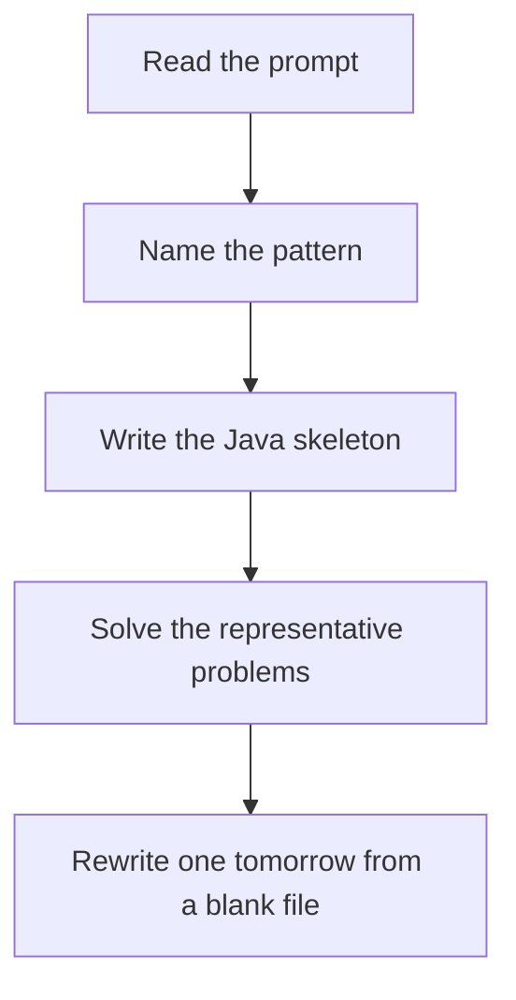

# Sliding window

DSA · 75 min

January. Maintain a window that is valid, or the smallest window that just became invalid. The answer hides in how the window changes, not in restarting from every index.

## Flow



## How to recognize it

Contiguous subarray or substring Longest, shortest, or count of windows that satisfy a condition Adding the right end and shrinking from the left fixes the condition Two of these in the prompt is enough. Say the pattern name out loud, then open the editor.

## The idea

Maintain a window that is valid, or the smallest window that just became invalid. The answer hides in how the window changes, not in restarting from every index.

## Java template

Type this from memory. Only the condition inside the loop changes between problems in this family.

```text
int left = 0;
for (int right = 0; right < n; right++) {
    // add s.charAt(right)
    while (/* window breaks the rule */) {
        // remove s.charAt(left++)
    }
    // update answer from [left, right]
}
```

## Problems that count

Longest Substring Without Repeating Characters (Medium). Last index of each char. Window of unique chars.

Max Consecutive Ones III (Medium). At most K zeros. Fruit Into Baskets and character replacement are the same window with a different count.

Minimum Window Substring (Hard). Need vs have counts. Shrink while the window still covers the target.

Binary Subarrays With Sum (Medium). Exactly K is atMost(K) minus atMost(K - 1). Nice subarrays is the same trick.

## Mistakes that make you blank in the interview

Restarting left from 0 on every right. That is brute force. Shrinking with if instead of while when one removal is not enough Treating at-most-K and exactly-K as the same. Exactly-K is atMost(K) - atMost(K-1).

## When this sits in the calendar

This is in the January must-set. It belongs in the 75-minute DSA block on weekdays. Do not add a new pattern on a day the previous rewrite failed.

## Play this

1. Name it before coding
2. Write the skeleton from memory
3. Solve the listed problems
4. Blank rewrite the next day

## Steps

- Recognition: Contiguous subarray or substring Longest, shortest, or count of windows that satisfy a condition Adding the right end and shrinking from the left fixes the condition
- If you cannot name it in a minute, this is pass 1: read one solution, then code it yourself.
- Pass 2 is the next day, empty file, no video. Pass 3 is day 3, pass 4 is day 7, pass 5 is day 15 to 30.
- Mark the attempt on the Patterns tab. Green means the rewrite worked alone.

## Example

```text
int left = 0;
for (int right = 0; right < n; right++) {
    // add s.charAt(right)
    while (/* window breaks the rule */) {
        // remove s.charAt(left++)
    }
    // update answer from [left, right]
}
```

## The usual miss

Restarting left from 0 on every right. That is brute force.

## They will ask

Walk Longest Substring Without Repeating Characters and say why this pattern fits.

## Before you close the laptop

Rewrite Longest Substring Without Repeating Characters tomorrow before any new pattern.
