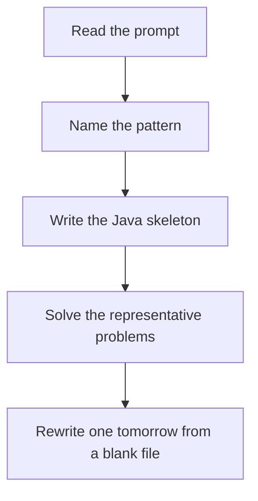

# Stack and queue

DSA · 75 min

January. A stack remembers unfinished work in reverse. Parentheses, DFS, and monotonic problems all start from that.

## Flow



## How to recognize it

Nested structure, last opened must close first Next smaller/greater is a different pattern; plain matching is this one You need undo, a min, or BFS order Two of these in the prompt is enough. Say the pattern name out loud, then open the editor.

## The idea

A stack remembers unfinished work in reverse. Parentheses, DFS, and monotonic problems all start from that.

## Java template

Type this from memory. Only the condition inside the loop changes between problems in this family.

```text
Deque<Character> stack = new ArrayDeque<>();
for (char ch : s.toCharArray()) {
    if (isOpen(ch)) stack.push(ch);
    else if (stack.isEmpty() || !matches(stack.pop(), ch)) return false;
}
return stack.isEmpty();
```

## Problems that count

Valid Parentheses (Easy). Match pairs. Empty at the end.

Min Stack (Medium). Push the value and the running min together.

Implement Queue using Stacks (Easy). Input stack and output stack. Amortized O(1).

## Mistakes that make you blank in the interview

Using Stack instead of ArrayDeque. Stack is synchronized and slower; the idea is the same, the tool is Deque. Popping an empty stack on a leading close bracket Min Stack storing only the minimum, not the history of minima

## When this sits in the calendar

This is in the January must-set. It belongs in the 75-minute DSA block on weekdays. Do not add a new pattern on a day the previous rewrite failed.

## Play this

1. Name it before coding
2. Write the skeleton from memory
3. Solve the listed problems
4. Blank rewrite the next day

## Steps

- Recognition: Nested structure, last opened must close first Next smaller/greater is a different pattern; plain matching is this one You need undo, a min, or BFS order
- If you cannot name it in a minute, this is pass 1: read one solution, then code it yourself.
- Pass 2 is the next day, empty file, no video. Pass 3 is day 3, pass 4 is day 7, pass 5 is day 15 to 30.
- Mark the attempt on the Patterns tab. Green means the rewrite worked alone.

## Example

```text
Deque<Character> stack = new ArrayDeque<>();
for (char ch : s.toCharArray()) {
    if (isOpen(ch)) stack.push(ch);
    else if (stack.isEmpty() || !matches(stack.pop(), ch)) return false;
}
return stack.isEmpty();
```

## The usual miss

Using Stack instead of ArrayDeque. Stack is synchronized and slower; the idea is the same, the tool is Deque.

## They will ask

Walk Valid Parentheses and say why this pattern fits.

## Before you close the laptop

Rewrite Valid Parentheses tomorrow before any new pattern.
