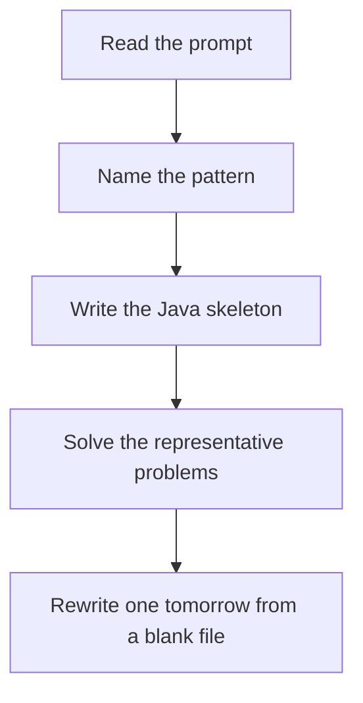

# Stock DP

DSA · one evening

After the January core is green. At each day you hold or you do not. Transitions are buy, sell, rest. Fees and cooldowns only change one transition.

## Flow



## How to recognize it

Buy and sell with a limit on transactions, a cooldown, or a fee State is day plus whether you hold a share, plus transactions left Two of these in the prompt is enough. Say the pattern name out loud, then open the editor.

## The idea

At each day you hold or you do not. Transitions are buy, sell, rest. Fees and cooldowns only change one transition.

## Java template

Type this from memory. Only the condition inside the loop changes between problems in this family.

```text
int hold = -prices[0];
int cash = 0;
for (int i = 1; i < prices.length; i++) {
    hold = Math.max(hold, cash - prices[i]);
    cash = Math.max(cash, hold + prices[i]);
}
```

## Problems that count

Best Time to Buy and Sell Stock (Easy). Min price so far, max profit. This is the one-transaction base.

Best Time to Buy and Sell Stock II (Medium). Unlimited trades. Add every upward difference, or the hold/cash pair.

Best Time to Buy and Sell Stock with Cooldown (Medium). Sold state cannot buy the next day.

## Mistakes that make you blank in the interview

One variable trying to remember a cooldown. Cooldown needs a third state. At most K transactions exploding into a new formula instead of a loop over k Selling and buying on the same day when the problem forbids it

## When this sits in the calendar

Do this only after the January patterns rewrite cleanly. One evening, one problem. It is not equal in weight to sliding window or basic DP.

## Play this

1. Name it before coding
2. Write the skeleton from memory
3. Solve the listed problems
4. Blank rewrite the next day

## Steps

- Recognition: Buy and sell with a limit on transactions, a cooldown, or a fee State is day plus whether you hold a share, plus transactions left
- If you cannot name it in a minute, this is pass 1: read one solution, then code it yourself.
- Pass 2 is the next day, empty file, no video. Pass 3 is day 3, pass 4 is day 7, pass 5 is day 15 to 30.
- Mark the attempt on the Patterns tab. Green means the rewrite worked alone.

## Example

```text
int hold = -prices[0];
int cash = 0;
for (int i = 1; i < prices.length; i++) {
    hold = Math.max(hold, cash - prices[i]);
    cash = Math.max(cash, hold + prices[i]);
}
```

## The usual miss

One variable trying to remember a cooldown. Cooldown needs a third state.

## They will ask

Walk Best Time to Buy and Sell Stock and say why this pattern fits.

## Before you close the laptop

Rewrite Best Time to Buy and Sell Stock tomorrow before any new pattern.
