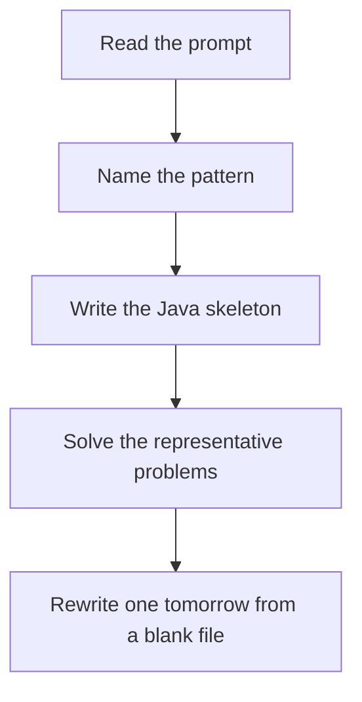

# KMP, Z, Rabin-Karp

DSA · one evening

After January. LPS says how far to jump after a mismatch, because that prefix is already known to match. You never restart the text index.

## Flow



## How to recognize it

Find a pattern in a text faster than checking every shift Longest prefix that is also a suffix Repeated string match, shortest palindrome Two of these in the prompt is enough. Say the pattern name out loud, then open the editor.

## The idea

LPS says how far to jump after a mismatch, because that prefix is already known to match. You never restart the text index.

## Java template

Type this from memory. Only the condition inside the loop changes between problems in this family.

```text
int[] lps(String pattern) {
    int[] pi = new int[pattern.length()];
    int len = 0;
    for (int i = 1; i < pattern.length();) {
        if (pattern.charAt(i) == pattern.charAt(len)) pi[i++] = ++len;
        else if (len > 0) len = pi[len - 1];
        else pi[i++] = 0;
    }
    return pi;
}
```

## Problems that count

Find the Index of the First Occurrence (Easy). Write KMP, not indexOf. The LPS array is the skill.

Shortest Palindrome (Hard). KMP on s + '#' + reverse(s). The last LPS value is the palindromic prefix.

Repeated String Match (Medium). Rabin-Karp or KMP. You need at most len(b)/len(a) + 2 copies.

## Mistakes that make you blank in the interview

Incrementing i on a mismatch when len > 0, which skips a character Learning Z, KMP, and Rabin-Karp as three lifestyles. LPS plus one use is enough for interviews. Rabin-Karp without a double hash or a verify step, so a collision becomes a wrong match

## When this sits in the calendar

Leave this until after January interviews are underway. MCM, trie depth, KMP, Z, and the exotic graph algorithms are real, and they are the wrong use of December.

## Play this

1. Name it before coding
2. Write the skeleton from memory
3. Solve the listed problems
4. Blank rewrite the next day

## Steps

- Recognition: Find a pattern in a text faster than checking every shift Longest prefix that is also a suffix Repeated string match, shortest palindrome
- If you cannot name it in a minute, this is pass 1: read one solution, then code it yourself.
- Pass 2 is the next day, empty file, no video. Pass 3 is day 3, pass 4 is day 7, pass 5 is day 15 to 30.
- Mark the attempt on the Patterns tab. Green means the rewrite worked alone.

## Example

```text
int[] lps(String pattern) {
    int[] pi = new int[pattern.length()];
    int len = 0;
    for (int i = 1; i < pattern.length();) {
        if (pattern.charAt(i) == pattern.charAt(len)) pi[i++] = ++len;
        else if (len > 0) len = pi[len - 1];
        else pi[i++] = 0;
    }
    return pi;
}
```

## The usual miss

Incrementing i on a mismatch when len > 0, which skips a character

## They will ask

Walk Find the Index of the First Occurrence and say why this pattern fits.

## Before you close the laptop

Rewrite Find the Index of the First Occurrence tomorrow before any new pattern.
