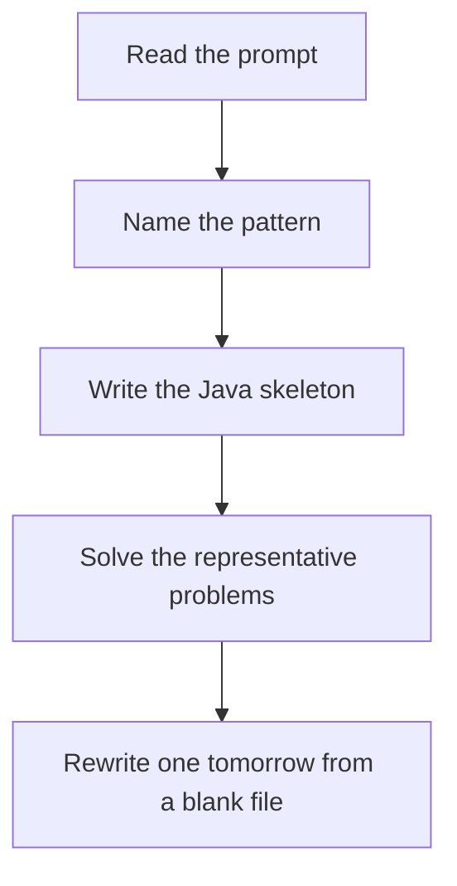

# String DP

DSA · one evening

After January. Edit distance is insert, delete, replace. A match or replace comes from the diagonal. Insert and delete come from the neighbors.

## Flow



## How to recognize it

Edit distance, palindrome cuts, wildcard, regex, distinct subsequences Two indexes, or a substring i..j Two of these in the prompt is enough. Say the pattern name out loud, then open the editor.

## The idea

Edit distance is insert, delete, replace. A match or replace comes from the diagonal. Insert and delete come from the neighbors.

## Java template

Type this from memory. Only the condition inside the loop changes between problems in this family.

```text
if (word1.charAt(i - 1) == word2.charAt(j - 1)) {
    dp[i][j] = dp[i - 1][j - 1];
} else {
    dp[i][j] = 1 + Math.min(dp[i - 1][j - 1], Math.min(dp[i - 1][j], dp[i][j - 1]));
}
```

## Problems that count

Longest Palindromic Subsequence (Medium). LCS of the string with its reverse.

Edit Distance (Medium). The three operations. Base cases are the gaps.

Distinct Subsequences (Hard). Count ways. Match uses diagonal plus the skip.

## Mistakes that make you blank in the interview

Wildcard star consuming the wrong row. Draw a 4-character example before coding. Palindrome subsequence confused with palindrome substring Base row and column left as 0, so turning an empty string into 'abc' costs nothing

## When this sits in the calendar

Leave this until after January interviews are underway. MCM, trie depth, KMP, Z, and the exotic graph algorithms are real, and they are the wrong use of December.

## Play this

1. Name it before coding
2. Write the skeleton from memory
3. Solve the listed problems
4. Blank rewrite the next day

## Steps

- Recognition: Edit distance, palindrome cuts, wildcard, regex, distinct subsequences Two indexes, or a substring i..j
- If you cannot name it in a minute, this is pass 1: read one solution, then code it yourself.
- Pass 2 is the next day, empty file, no video. Pass 3 is day 3, pass 4 is day 7, pass 5 is day 15 to 30.
- Mark the attempt on the Patterns tab. Green means the rewrite worked alone.

## Example

```text
if (word1.charAt(i - 1) == word2.charAt(j - 1)) {
    dp[i][j] = dp[i - 1][j - 1];
} else {
    dp[i][j] = 1 + Math.min(dp[i - 1][j - 1], Math.min(dp[i - 1][j], dp[i][j - 1]));
}
```

## The usual miss

Wildcard star consuming the wrong row. Draw a 4-character example before coding.

## They will ask

Walk Longest Palindromic Subsequence and say why this pattern fits.

## Before you close the laptop

Rewrite Longest Palindromic Subsequence tomorrow before any new pattern.
