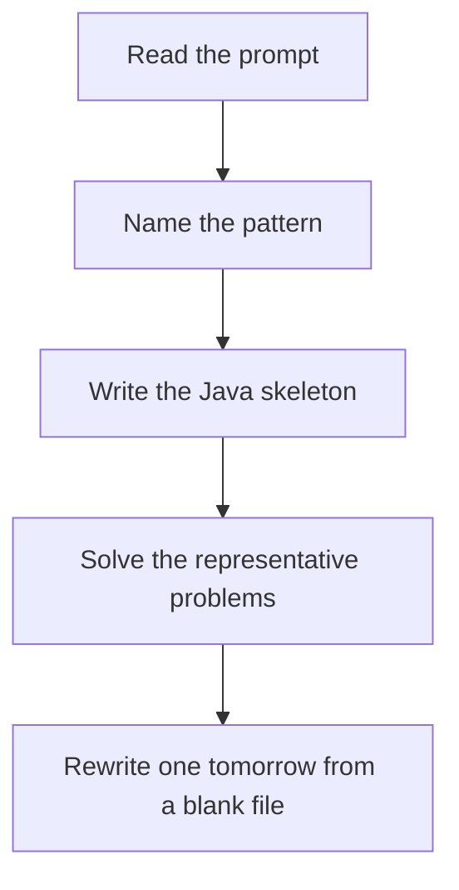

# Topological sort

DSA · 75 min

January. Kahn: repeatedly take nodes with indegree 0. If you cannot take every node, there was a cycle. DFS postorder reversed is the other version.

## Flow



## How to recognize it

Ordering with prerequisites Alien dictionary, build order, course schedule II Directed acyclic graph Two of these in the prompt is enough. Say the pattern name out loud, then open the editor.

## The idea

Kahn: repeatedly take nodes with indegree 0. If you cannot take every node, there was a cycle. DFS postorder reversed is the other version.

## Java template

Type this from memory. Only the condition inside the loop changes between problems in this family.

```text
Queue<Integer> queue = new ArrayDeque<>();
for (int i = 0; i < n; i++) if (indegree[i] == 0) queue.add(i);
List<Integer> order = new ArrayList<>();
while (!queue.isEmpty()) {
    int node = queue.remove();
    order.add(node);
    for (int next : graph[node]) {
        if (--indegree[next] == 0) queue.add(next);
    }
}
```

## Problems that count

Course Schedule II (Medium). Kahn's algorithm. Return any valid order.

Course Schedule (Medium). Same graph. Here you only return whether the order is complete.

Alien Dictionary (Hard). Premium on LeetCode. Build edges from adjacent words, then topo. If you lack premium, redo Course Schedule II from a blank file.

## Mistakes that make you blank in the interview

Edge direction reversed, so indegree means the wrong thing Returning a partial order when a cycle left nodes behind Alien dictionary: comparing whole words instead of the first differing character

## When this sits in the calendar

This is in the January must-set. It belongs in the 75-minute DSA block on weekdays. Do not add a new pattern on a day the previous rewrite failed.

## Play this

1. Name it before coding
2. Write the skeleton from memory
3. Solve the listed problems
4. Blank rewrite the next day

## Steps

- Recognition: Ordering with prerequisites Alien dictionary, build order, course schedule II Directed acyclic graph
- If you cannot name it in a minute, this is pass 1: read one solution, then code it yourself.
- Pass 2 is the next day, empty file, no video. Pass 3 is day 3, pass 4 is day 7, pass 5 is day 15 to 30.
- Mark the attempt on the Patterns tab. Green means the rewrite worked alone.

## Example

```text
Queue<Integer> queue = new ArrayDeque<>();
for (int i = 0; i < n; i++) if (indegree[i] == 0) queue.add(i);
List<Integer> order = new ArrayList<>();
while (!queue.isEmpty()) {
    int node = queue.remove();
    order.add(node);
    for (int next : graph[node]) {
        if (--indegree[next] == 0) queue.add(next);
    }
}
```

## The usual miss

Edge direction reversed, so indegree means the wrong thing

## They will ask

Walk Course Schedule II and say why this pattern fits.

## Before you close the laptop

Rewrite Course Schedule II tomorrow before any new pattern.
