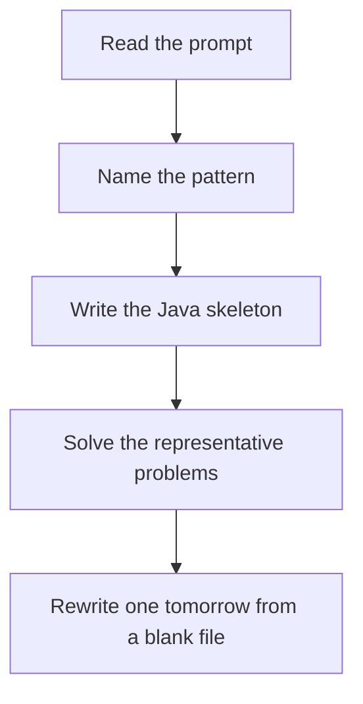

# Tree BFS

DSA · 75 min

January. Queue plus the size of the current level. Process exactly that many nodes, then the queue holds the next level.

## Flow



## How to recognize it

Level order, right view, width, minimum depth The answer is 'the first time I see a level' You need every node at distance d before distance d+1 Two of these in the prompt is enough. Say the pattern name out loud, then open the editor.

## The idea

Queue plus the size of the current level. Process exactly that many nodes, then the queue holds the next level.

## Java template

Type this from memory. Only the condition inside the loop changes between problems in this family.

```text
Queue<TreeNode> queue = new ArrayDeque<>();
queue.add(root);
while (!queue.isEmpty()) {
    int size = queue.size();
    for (int i = 0; i < size; i++) {
        TreeNode node = queue.remove();
        if (node.left != null) queue.add(node.left);
        if (node.right != null) queue.add(node.right);
    }
}
```

## Problems that count

Binary Tree Level Order Traversal (Medium). The size snapshot is the whole trick.

Binary Tree Right Side View (Medium). Last node of each level.

Maximum Width of Binary Tree (Medium). Store index with the node. Width is right - left + 1.

## Mistakes that make you blank in the interview

Forgetting to snapshot queue.size() and then looping while the queue grows Right view by DFS right-first is fine, but know the BFS version too Maximum width: index nodes as heap indexes, watch overflow with long

## When this sits in the calendar

This is in the January must-set. It belongs in the 75-minute DSA block on weekdays. Do not add a new pattern on a day the previous rewrite failed.

## Play this

1. Name it before coding
2. Write the skeleton from memory
3. Solve the listed problems
4. Blank rewrite the next day

## Steps

- Recognition: Level order, right view, width, minimum depth The answer is 'the first time I see a level' You need every node at distance d before distance d+1
- If you cannot name it in a minute, this is pass 1: read one solution, then code it yourself.
- Pass 2 is the next day, empty file, no video. Pass 3 is day 3, pass 4 is day 7, pass 5 is day 15 to 30.
- Mark the attempt on the Patterns tab. Green means the rewrite worked alone.

## Example

```text
Queue<TreeNode> queue = new ArrayDeque<>();
queue.add(root);
while (!queue.isEmpty()) {
    int size = queue.size();
    for (int i = 0; i < size; i++) {
        TreeNode node = queue.remove();
        if (node.left != null) queue.add(node.left);
        if (node.right != null) queue.add(node.right);
    }
}
```

## The usual miss

Forgetting to snapshot queue.size() and then looping while the queue grows

## They will ask

Walk Binary Tree Level Order Traversal and say why this pattern fits.

## Before you close the laptop

Rewrite Binary Tree Level Order Traversal tomorrow before any new pattern.
