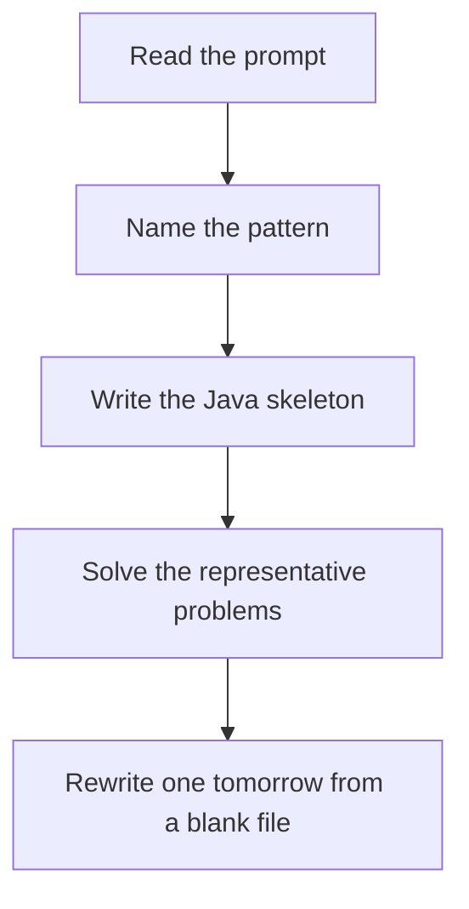

# Tree DFS

DSA · 75 min

January. A node asks its children for a small summary, then combines them. Global answers like diameter are updated as a side effect of that summary.

## Flow



## How to recognize it

Answer depends on both subtrees: height, diameter, path through a node You can return a value from the child and decide at the parent LCA, path sum, balanced tree Two of these in the prompt is enough. Say the pattern name out loud, then open the editor.

## The idea

A node asks its children for a small summary, then combines them. Global answers like diameter are updated as a side effect of that summary.

## Java template

Type this from memory. Only the condition inside the loop changes between problems in this family.

```text
int dfs(TreeNode node) {
    if (node == null) return 0;
    int left = dfs(node.left);
    int right = dfs(node.right);
    best = Math.max(best, left + right);
    return 1 + Math.max(left, right);
}
```

## Problems that count

Diameter of Binary Tree (Easy). Height returned, diameter stored outside.

Path Sum III (Medium). Prefix sums on the path down, backtrack the map.

Lowest Common Ancestor of a Binary Tree (Medium). If both sides return a node, this node is the LCA.

## Mistakes that make you blank in the interview

Returning the diameter from dfs and also using that return as height Path sum counting paths that must start at the root when any node can start Null pointer on node.left without a base case

## When this sits in the calendar

This is in the January must-set. It belongs in the 75-minute DSA block on weekdays. Do not add a new pattern on a day the previous rewrite failed.

## Play this

1. Name it before coding
2. Write the skeleton from memory
3. Solve the listed problems
4. Blank rewrite the next day

## Steps

- Recognition: Answer depends on both subtrees: height, diameter, path through a node You can return a value from the child and decide at the parent LCA, path sum, balanced tree
- If you cannot name it in a minute, this is pass 1: read one solution, then code it yourself.
- Pass 2 is the next day, empty file, no video. Pass 3 is day 3, pass 4 is day 7, pass 5 is day 15 to 30.
- Mark the attempt on the Patterns tab. Green means the rewrite worked alone.

## Example

```text
int dfs(TreeNode node) {
    if (node == null) return 0;
    int left = dfs(node.left);
    int right = dfs(node.right);
    best = Math.max(best, left + right);
    return 1 + Math.max(left, right);
}
```

## The usual miss

Returning the diameter from dfs and also using that return as height

## They will ask

Walk Diameter of Binary Tree and say why this pattern fits.

## Before you close the laptop

Rewrite Diameter of Binary Tree tomorrow before any new pattern.
