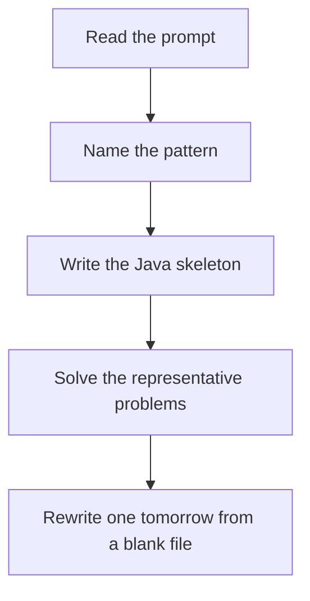

# Trie

DSA · one evening

After January. Each edge is a character. A word is a path. Sharing prefixes is the memory win. XOR trie walks the opposite bit when it exists.

## Flow



## How to recognize it

Many prefix queries Word search on a board with a dictionary XOR maximize: a binary trie of bits Two of these in the prompt is enough. Say the pattern name out loud, then open the editor.

## The idea

Each edge is a character. A word is a path. Sharing prefixes is the memory win. XOR trie walks the opposite bit when it exists.

## Java template

Type this from memory. Only the condition inside the loop changes between problems in this family.

```text
class Node {
    Node[] next = new Node[26];
    boolean word;
}
void insert(String word) {
    Node cur = root;
    for (char ch : word.toCharArray()) {
        int i = ch - 'a';
        if (cur.next[i] == null) cur.next[i] = new Node();
        cur = cur.next[i];
    }
    cur.word = true;
}
```

## Problems that count

Implement Trie (Medium). Insert, search, startsWith.

Word Search II (Hard). Trie plus board DFS. Remove a word after you find it.

Maximum XOR of Two Numbers (Medium). Binary trie. Prefer the opposite bit from bit 31 downward.

## Mistakes that make you blank in the interview

HashSet of every prefix when a trie was the point. A set is fine for one problem; still build the node version. Word Search II without pruning the trie, so you rescan dead branches Binary trie using characters instead of bits 0 and 1 from the high end

## When this sits in the calendar

Leave this until after January interviews are underway. MCM, trie depth, KMP, Z, and the exotic graph algorithms are real, and they are the wrong use of December.

## Play this

1. Name it before coding
2. Write the skeleton from memory
3. Solve the listed problems
4. Blank rewrite the next day

## Steps

- Recognition: Many prefix queries Word search on a board with a dictionary XOR maximize: a binary trie of bits
- If you cannot name it in a minute, this is pass 1: read one solution, then code it yourself.
- Pass 2 is the next day, empty file, no video. Pass 3 is day 3, pass 4 is day 7, pass 5 is day 15 to 30.
- Mark the attempt on the Patterns tab. Green means the rewrite worked alone.

## Example

```text
class Node {
    Node[] next = new Node[26];
    boolean word;
}
void insert(String word) {
    Node cur = root;
    for (char ch : word.toCharArray()) {
        int i = ch - 'a';
        if (cur.next[i] == null) cur.next[i] = new Node();
        cur = cur.next[i];
    }
    cur.word = true;
}
```

## The usual miss

HashSet of every prefix when a trie was the point. A set is fine for one problem; still build the node version.

## They will ask

Walk Implement Trie and say why this pattern fits.

## Before you close the laptop

Rewrite Implement Trie tomorrow before any new pattern.
