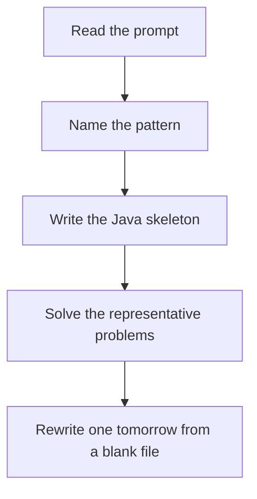

# Two pointers

DSA · 75 min

January. Sorted order gives you a direction. If the sum is too small, move left. If too big, move right.

## Flow



## How to recognize it

Sorted array, or you are allowed to sort Pair, triplet, or two ends moving toward each other You can discard one side without missing the answer Two of these in the prompt is enough. Say the pattern name out loud, then open the editor.

## The idea

Sorted order gives you a direction. If the sum is too small, move left. If too big, move right.

## Java template

Type this from memory. Only the condition inside the loop changes between problems in this family.

```text
int left = 0;
int right = nums.length - 1;
while (left < right) {
    int sum = nums[left] + nums[right];
    if (sum == target) return new int[] {left, right};
    if (sum < target) left++;
    else right--;
}
```

## Problems that count

Two Sum II (Easy). Sorted input. This is the skeleton.

3Sum (Medium). Sort, fix one index, two-pointer the rest, skip duplicates.

Container With Most Water (Medium). Move the shorter side. Area is width times min height.

## Mistakes that make you blank in the interview

Skipping duplicate handling in 3Sum and returning the same triplet Moving both pointers when only one side is wrong Using two pointers on an unsorted array without sorting first

## When this sits in the calendar

This is in the January must-set. It belongs in the 75-minute DSA block on weekdays. Do not add a new pattern on a day the previous rewrite failed.

## Play this

1. Name it before coding
2. Write the skeleton from memory
3. Solve the listed problems
4. Blank rewrite the next day

## Steps

- Recognition: Sorted array, or you are allowed to sort Pair, triplet, or two ends moving toward each other You can discard one side without missing the answer
- If you cannot name it in a minute, this is pass 1: read one solution, then code it yourself.
- Pass 2 is the next day, empty file, no video. Pass 3 is day 3, pass 4 is day 7, pass 5 is day 15 to 30.
- Mark the attempt on the Patterns tab. Green means the rewrite worked alone.

## Example

```text
int left = 0;
int right = nums.length - 1;
while (left < right) {
    int sum = nums[left] + nums[right];
    if (sum == target) return new int[] {left, right};
    if (sum < target) left++;
    else right--;
}
```

## The usual miss

Skipping duplicate handling in 3Sum and returning the same triplet

## They will ask

Walk Two Sum II and say why this pattern fits.

## Before you close the laptop

Rewrite Two Sum II tomorrow before any new pattern.
