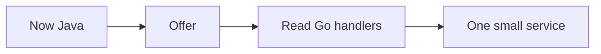

# Go after the offer, at reading depth

Go · 20 min

Apple storage and Cisco distributed roles mention Go beside Java. That is a reason to read Go, not a reason to pause Java. After the switch, one small service is enough.

## Flow



## Play this

1. Do not context-switch this winter
2. After April, read net/http
3. Goroutines are the concurrency primitive
4. Errors are values

## Steps

- A handler, a struct, and an error return are the first page.
- You do not start with a framework tour.
- Storage-infrastructure posts want Linux, Kubernetes, and a language. Your storage stories plus Java already qualify you to talk. Go is the gap you close on the job.

## Example

```text
func (s *Server) GetBucket(w http.ResponseWriter, r *http.Request)
```

## The usual miss

Rewriting the flagship in Go in November.

## They will ask

What will you learn in Go, and when?

## Before you close the laptop

Add a single line to the April plan: read one Go HTTP file a week. Not before.
