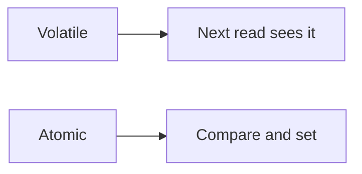

# Atomic and volatile

Java · 20 min

volatile publishes a write. Atomic updates a number. Neither is a lock for a multi-step check.

## Flow



## Atomic and volatile

A volatile flag is visible. count++ on a volatile long is still two operations and can lose updates. AtomicInteger.incrementAndGet is the increment. getAndUpdate is the bucket refill if the whole decision fits in one value. Two fields that must change together need a lock or one immutable object swapped with an AtomicReference. Say that sentence in the interview. It separates you from a glossary.

## Play this

1. Name it
2. Say the rule
3. Tie it to the project or a problem
4. One sentence from memory tomorrow

## Steps

- Read the rule once.
- Write the example from a blank file.
- Say the interview answer out loud.

## Example

```text
AtomicInteger tokens = new AtomicInteger(10);
tokens.updateAndGet(n -> Math.max(0, n - 1));
```

## The usual miss

volatile int count; count++; and calling it atomic.

## They will ask

Is volatile enough for a token bucket?

## Before you close the laptop

Write the updateAndGet line and say what it still cannot do.
