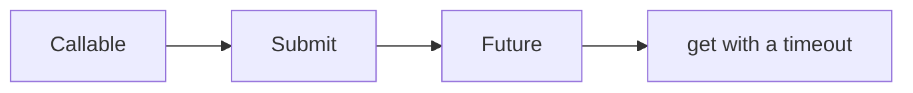

# Callable and Future

Java · 20 min

Callable returns a value and can throw. Future is the handle.

## Flow



## Callable and Future

submit returns a Future. get blocks. get without a timeout can block a request thread forever. cancel(true) interrupts if the task cooperates. Future does not compose. That is why CompletableFuture exists. Use Future when you only need one result and a timeout. Check isDone only if you have something else to do. Swallowing ExecutionException loses the cause. Unwrap it.

## Play this

1. Name it
2. Say the rule
3. Tie it to the project or a problem
4. One sentence from memory tomorrow

## Steps

- Read the rule once.
- Write the example from a blank file.
- Say the interview answer out loud.

## Example

```text
Future<String> f = pool.submit(() -> load(id));
String body = f.get(2, TimeUnit.SECONDS);
```

## The usual miss

get() with no timeout on a web thread.

## They will ask

How do you stop waiting?

## Before you close the laptop

Say the timeout you would put on a metadata read.
