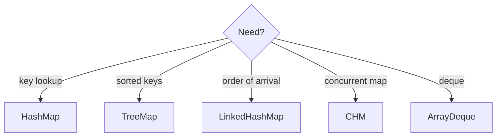

# Collections you must choose out loud

Java · 30 min

The question is rarely the syntax. It is why this collection, and what it costs.

## Flow



## The choice

ArrayList for indexed reads. LinkedList almost never in interview code. HashSet for membership. TreeSet when you need order. ArrayDeque as a stack or queue. PriorityQueue as a heap. ConcurrentHashMap when two threads share the map. Name the operation you do most, then the structure.

## Play this

1. Name the operation
2. Name the cost
3. Reject java.util.Stack
4. ArrayDeque for stack and queue

## Steps

- HashMap is expected O(1) and unordered. TreeMap is O(log n) and sorted.
- ConcurrentHashMap allows concurrent readers and segmented updates. It is not a lock around the whole map.
- Optional is for a return value that might be absent. It is not a field type on an entity.

## Example

```text
Stack is a legacy synchronized Vector. Say ArrayDeque.
```

## The usual miss

Picking a List and scanning it when a map was the point.

## They will ask

When would you refuse a HashMap?

## Before you close the laptop

Write three method signatures and name the collection in the margin before any code.
