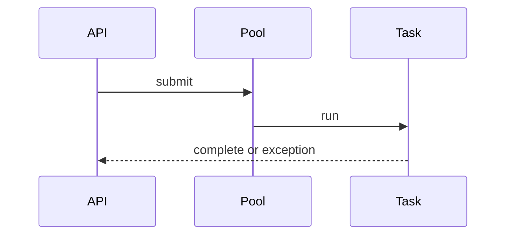

# Executors, futures, and CompletableFuture

Java · 45 min

Your resume already mentions asynchronous work. The interview will ask what runs where, what happens on failure, and how you avoid blocking the common pool.

## Flow



## Play this

1. Do not new Thread in a request
2. Name the pool
3. Handle the exception
4. Do not block on the common pool

## Steps

- ExecutorService owns the threads. Future is the handle. CompletableFuture composes them.
- supplyAsync on the common pool is fine for CPU work that is short. Blocking IO needs your own pool.
- exceptionally or handle, or the exception disappears until someone joins.

## Example

```text
CompletableFuture<String> body = CompletableFuture
  .supplyAsync(this::readLogs, ioPool)
  .exceptionally(error -> "logs unavailable");
```

## The usual miss

Calling get() on the thread that is supposed to stay free.

## They will ask

What happens if the callable throws?

## Before you close the laptop

Draw the pool you would use for log collection versus the pool for a CPU score.
