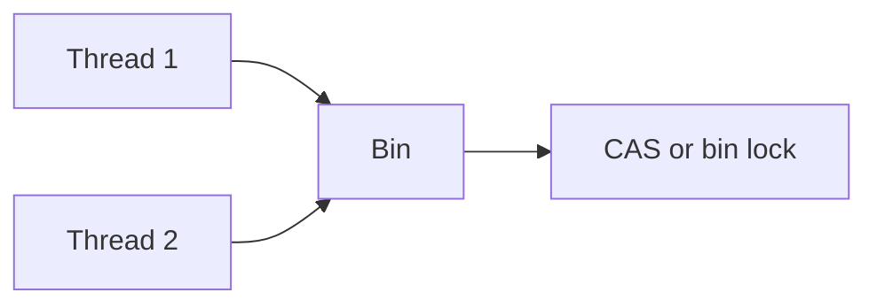

# ConcurrentHashMap

Java · 25 min

This is the map two threads may share. A plain HashMap is not.

## Flow



## ConcurrentHashMap

ConcurrentHashMap allows concurrent readers and updates bins with CAS or a short lock. It does not allow null keys or values. size is an estimate under concurrency. compute and merge are atomic for one key. It does not lock the whole map, and it does not make a check-then-act across two keys atomic. If you need 'if absent then insert and also update another structure', you still need a lock or a single key that holds both facts. Your interview story: the cache of in-flight requests, not the business ledger.

## Play this

1. Name it
2. Say the rule
3. Tie it to the project or a problem
4. One sentence from memory tomorrow

## Steps

- Read the rule once.
- Write the example from a blank file.
- Say the interview answer out loud.

## Example

```text
map.compute(key, (k, v) -> v == null ? 1 : v + 1);
```

## The usual miss

Wrapping a HashMap in Collections.synchronizedMap and calling it the same thing. That lock is the whole map.

## They will ask

Can two threads update different keys at the same time?

## Before you close the laptop

Write compute for a counter. Say what it does not protect.
