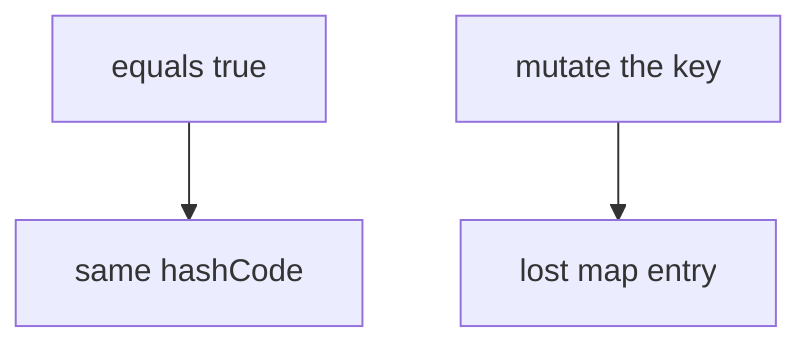

# equals and hashCode

Java · 25 min

The contract is the interview. Equal objects must share a hash. Unequal objects should usually not.

## Flow



## equals and hashCode

If a.equals(b), then a.hashCode() == b.hashCode(). The reverse is not required. Consistency: equals does not change while the object is a key. Reflexive, symmetric, transitive. A subclass that adds a field and breaks symmetry is a bug. Records give you both methods. Mutable keys are how entries disappear: the bucket was chosen with the old hash. Include the same fields in both methods. An IDE-generated pair is fine if you read it.

## Play this

1. Name it
2. Say the rule
3. Tie it to the project or a problem
4. One sentence from memory tomorrow

## Steps

- Read the rule once.
- Write the example from a blank file.
- Say the interview answer out loud.

## Example

```text
record BucketId(String id) {}
// equals and hashCode follow id
```

## The usual miss

Overriding equals and leaving the identity hashCode.

## They will ask

Two keys are equal and the map still misses. What did you break?

## Before you close the laptop

Point at one key type in the project and name its fields.
