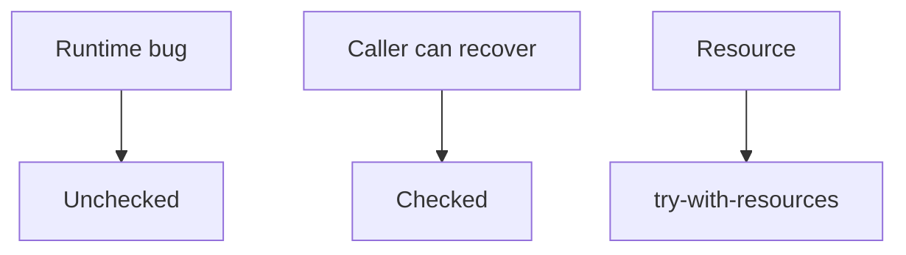

# Exception handling

Java · 20 min

Throw the failure the caller can act on. Do not swallow it.

## Flow



## Exception handling

Unchecked exceptions are bugs and domain failures you map at the edge. Checked exceptions force a signature and are rare in Spring services. A catch that logs and returns null turns a failure into a later NullPointerException and hides the metric. try-with-resources closes in reverse order of creation. Do not catch Throwable. Add context to the message: bucket id, not 'error'. The Spring advice page turns the domain exception into a status code. This page is the Java rule under that.

## Play this

1. Name it
2. Say the rule
3. Tie it to the project or a problem
4. One sentence from memory tomorrow

## Steps

- Read the rule once.
- Write the example from a blank file.
- Say the interview answer out loud.

## Example

```text
try (var in = new BufferedReader(reader)) {
    return in.readLine();
}
```

## The usual miss

An empty catch.

## They will ask

What closes, and in what order?

## Before you close the laptop

Name the one exception your API turns into 409.
