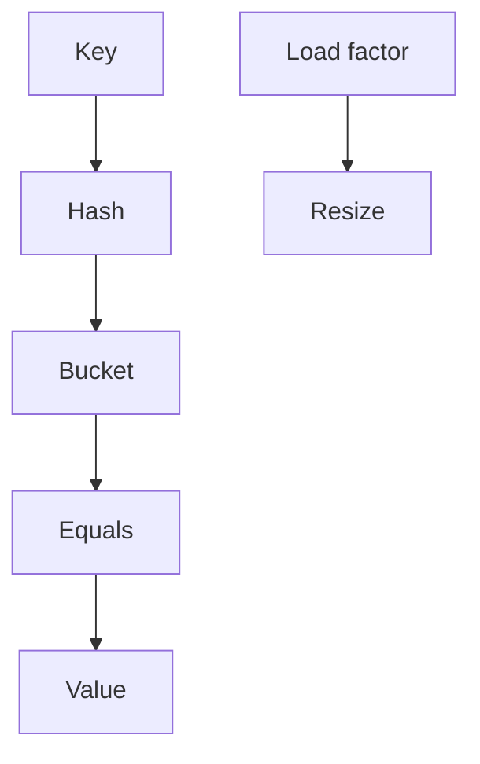

# HashMap internals

Java · 45 min

Interviewers use HashMap to see if you know the structure you call every day. Buckets, hash spreading, equals versus hashCode, and resize are the whole answer.

## Flow



## Play this

1. Compute hash
2. Pick a bucket
3. Walk equals
4. Resize when full

## Steps

- hashCode chooses the bucket. equals decides if the key is the one you want.
- If you override equals you override hashCode. Otherwise a HashSet silently keeps duplicates.
- Java 8 turns a long collision chain into a tree. You should know that the chain is not always a linked list.

## Example

```text
class Key {
  final String id;
  @Override public int hashCode() { return id.hashCode(); }
  @Override public boolean equals(Object o) {
    return o instanceof Key k && id.equals(k.id);
  }
}
```

## The usual miss

Using the array index as identity and skipping equals.

## They will ask

What breaks if hashCode changes while the key sits in the map?

## Before you close the laptop

Break a HashSet on purpose by deleting hashCode. Put the class back.
