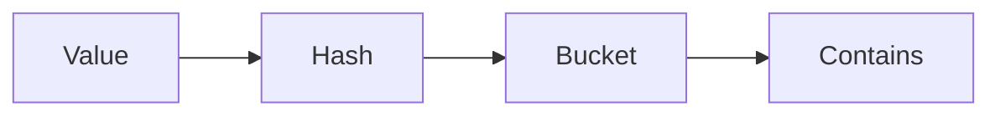

# HashSet

Java · 20 min

A HashSet is a HashMap whose values you ignore. Membership is the operation. Order is not.

## Flow



## HashSet

HashSet stores the element as the map key and a dummy as the value. contains is hash then equals. There is no index. Iteration order is not insertion order. TreeSet is the sorted alternative and costs log n. Use a set for 'have I seen this' in Two Sum's cousins and in cycle detection when you are allowed extra memory. Do not use it when the question is teaching Floyd's pointers.

## Play this

1. Name it
2. Say the rule
3. Tie it to the project or a problem
4. One sentence from memory tomorrow

## Steps

- Read the rule once.
- Write the example from a blank file.
- Say the interview answer out loud.

## Example

```text
Set<Integer> seen = new HashSet<>();
if (!seen.add(value)) { /* duplicate */ }
```

## The usual miss

Depending on iteration order.

## They will ask

How is HashSet implemented, and when do you pick TreeSet?

## Before you close the laptop

Say the one line: add returns false when the value was already there.
