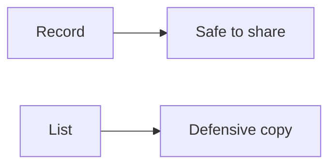

# Immutability

Java · 15 min

An immutable value cannot change after it is published. That is how events stay honest.

## Flow



## Immutability

A record with final components is the default carrier for an event or a request. Defensively copy a list you store. Do not return your internal list. Immutability removes a class of races: nobody mutates the key that already chose a HashMap bucket. Builder is for a large construction. It still ends in an immutable object. The outbox row is a fact. The object you publish should be as hard to edit as that row.

## Play this

1. Name it
2. Say the rule
3. Tie it to the project or a problem
4. One sentence from memory tomorrow

## Steps

- Read the rule once.
- Write the example from a blank file.
- Say the interview answer out loud.

## Example

```text
record ObjectEvent(String id, String bucketId, long bytes) {}
```

## The usual miss

A public list field on a 'immutable' class.

## They will ask

Why is a record a good Kafka payload?

## Before you close the laptop

Make the event type in the project a record on paper.
