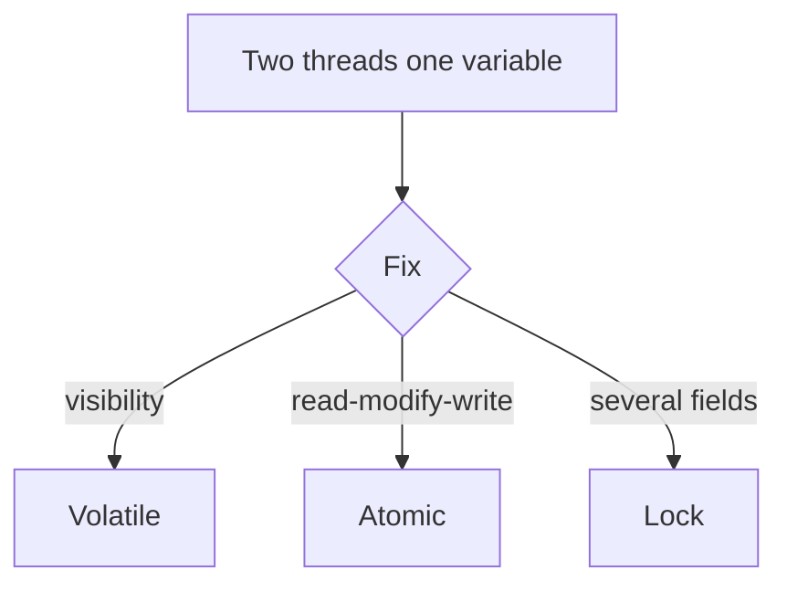

# volatile, locks, atomics, deadlock

Java · 40 min

You need the vocabulary of visibility and exclusion. You do not need to recite the Java Memory Model chapter.

## Flow



## Play this

1. volatile is visibility
2. Atomic is a single variable update
3. Lock guards a block
4. Deadlock is lock order

## Steps

- volatile does not make count++ safe. The increment is three steps.
- synchronized or ReentrantLock gives exclusion. Always take locks in the same order.
- A deadlock story: thread A holds lock 1 and wants lock 2, thread B holds lock 2 and wants lock 1.

## Example

```text
AtomicLong for a counter. A lock when two fields must change together.
```

## The usual miss

Sprinkling volatile on a compound action and calling it thread-safe.

## They will ask

Give a race that volatile does not fix.

## Before you close the laptop

Write a 6-line deadlock on paper, then the lock-order fix.
