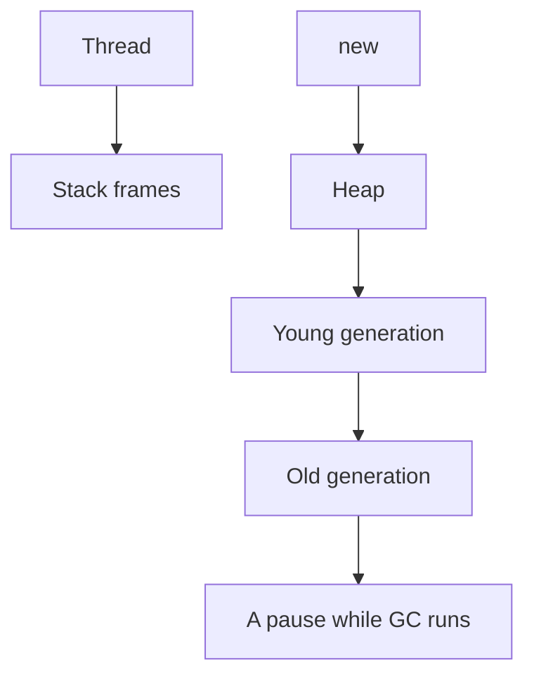

# JVM, stack, heap, and GC

Java · 30 min

You need a clear story, not a collector catalog. Interviewers ask where an object lives and what a pause is.

## Flow



## The story in four sentences

Each thread has a stack. new allocates on the heap. When no thread can reach an object, GC can reclaim it. A stop-the-world pause freezes application threads so the collector can move or mark memory, and that pause shows up as latency. Modern collectors shorten the pause. They do not make an unbounded cache correct.

## What you refuse to pretend

You do not tune G1 versus ZGC from memory in an interview. You say what you would measure: allocation rate, pause time, and the dominator in a heap dump. For this project the bounded structures are the rate-limit map, the agent session in Redis, and the Kafka consumer's in-flight count.

## Play this

1. Stack is the frame
2. Heap is the objects
3. GC reclaims unreachable objects
4. A pause is latency

## Steps

- Local variables and calls live on the stack. Objects and arrays live on the heap.
- A leak in a server is usually a collection that grows: a static map, a listener, an unbounded queue.
- Generational GC collects young garbage often. A long-lived cache belongs in a bounded structure with eviction, not in the hope that GC will save you.
- You look at a heap dump or at least at live set and pause time before you change flags.

## Example

```text
OutOfMemoryError: Java heap space
First question: which collection grew?
Second: is the cache bounded?
```

## The usual miss

Adding -Xmx until the box dies, without finding the collection.

## They will ask

Where does a HashMap entry live, and what makes it unreachable?

## Before you close the laptop

Name one structure in the project that must have a max size.
