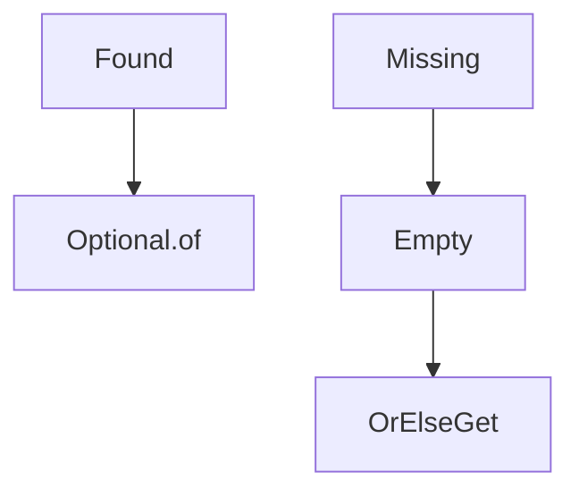

# Optional

Java · 15 min

Optional is a return type for a missing value. It is not a field, and it is not a parameter.

## Flow



## Optional

Optional.of throws on null. ofNullable does not. get throws if empty. orElse evaluates its argument always. orElseGet evaluates the supplier only when empty. Use orElseGet for a database lookup. An Optional field hides a model you should make explicit. Do not store Optional in a HashMap. Returning Optional from a repository method is a fair API. Returning it from a getter of a JPA entity is noise.

## Play this

1. Name it
2. Say the rule
3. Tie it to the project or a problem
4. One sentence from memory tomorrow

## Steps

- Read the rule once.
- Write the example from a blank file.
- Say the interview answer out loud.

## Example

```text
return rows.stream().findFirst().orElseGet(this::loadDefault);
```

## The usual miss

Calling get because the IDE offered it.

## They will ask

Why is orElse(load()) different from orElseGet?

## Before you close the laptop

Find one get() in your code and replace it.
