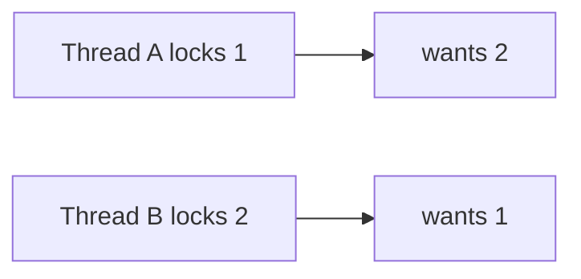

# Races and deadlocks

Java · 20 min

A race is a result that depends on timing. A deadlock is a cycle of locks. You should be able to draw both.

## Flow



## Races and deadlocks

The token-bucket race: two threads read 1 token, both pass, the count goes negative. The fix is one atomic update or one lock around the decision. Deadlock needs two locks and two orders. Take locks in a single global order, or hold only one. jstack shows the cycle. A tryLock with a timeout turns a deadlock into a retry. Do not lock in an order that follows user input, such as lock(bucketA) then lock(bucketB) while another request does the reverse.

## Play this

1. Name it
2. Say the rule
3. Tie it to the project or a problem
4. One sentence from memory tomorrow

## Steps

- Read the rule once.
- Write the example from a blank file.
- Say the interview answer out loud.

## Example

```text
// one order: sort the two ids, then lock
if (id1.compareTo(id2) < 0) { lock(id1); lock(id2); }
```

## The usual miss

Adding synchronized to every method until the bug hides.

## They will ask

Draw a deadlock with two buckets.

## Before you close the laptop

Write the sort-then-lock order on a card.
