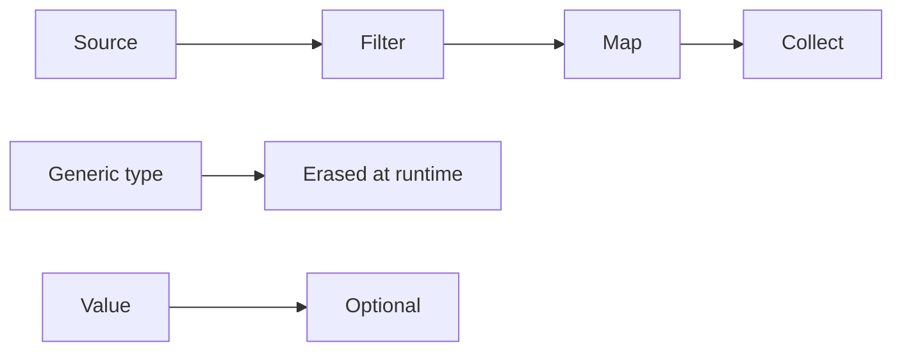

# Streams, generics, Optional, immutability

Java · 40 min

This is the Java you use and then fail to explain. The questions are small and they sort people who only remember syntax.

## Flow



## Streams

Intermediate operations build a pipeline. The terminal operation pulls values. forEach is a terminal that gives you nothing back. Collect or toList is the one you want. Parallel streams on a small list, or on a stream that touches JDBC, are a performance bug. Say: I keep streams sequential unless I have measured a CPU-bound pure function.

## Generics and Optional

List<String> is List at runtime. That is why a raw list can be polluted. PECS: producer extends, consumer super. Optional expresses a missing return. orElse throws away a costly default because it evaluates the argument. orElseGet takes a supplier. Empty optionals in a field hide the real model. Use a nullable only at the edge, and Optional as the return.

## equals, hashCode, immutability

If equals says two keys are the same, hashCode must match, or HashMap loses the entry. Mutable keys change the bucket after insertion. Prefer a record for a key or a request. Defensive copy a list you store. Immutability is how you stop a caller from changing the event you already published.

## Play this

1. Streams are pipelines, not loops with style
2. Type erasure is real
3. Optional is a return type
4. A record is the immutable carrier

## Steps

- A stream does not run until a terminal operation. map and filter are lazy. A stream is used once.
- Generics erase to Object. You cannot new T() or check instanceof T. A wildcard ? extends is for reading, ? super is for writing.
- Optional.ofNullable at a boundary. Do not pass Optional into fields and collections.
- equals and hashCode stay a pair. A record gives you both, and an immutable value.

## Example

```text
List<String> names = items.stream()
    .map(Item::name)
    .filter(name -> !name.isBlank())
    .toList();
```

## The usual miss

Using Optional.get() because the IDE suggested it.

## They will ask

Why can two objects be equal and land in different HashMap buckets?

## Before you close the laptop

Rewrite one loop in the project as a stream, then say what the terminal operation is.
