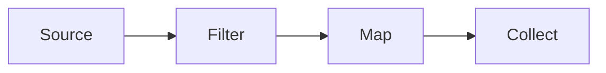

# Streams

Java · 20 min

A stream is a pipeline that runs when the terminal operation pulls.

## Flow



## Streams

map and filter are lazy and do not run alone. toList, reduce, and findFirst are terminal. A stream is consumed once. forEach that only prints is a weak use. Side effects inside map hide bugs. Parallel streams on JDBC or on a tiny list are slower and less safe. Keep them sequential unless you measured a pure CPU function. Collectors.groupingBy is the HashMap you would have written by hand.

## Play this

1. Name it
2. Say the rule
3. Tie it to the project or a problem
4. One sentence from memory tomorrow

## Steps

- Read the rule once.
- Write the example from a blank file.
- Say the interview answer out loud.

## Example

```text
Map<String, Long> counts = words.stream()
    .collect(Collectors.groupingBy(w -> w, Collectors.counting()));
```

## The usual miss

A parallel stream over a shared ArrayList.

## They will ask

When does the filter run?

## Before you close the laptop

Rewrite one loop. Name the terminal operation.
