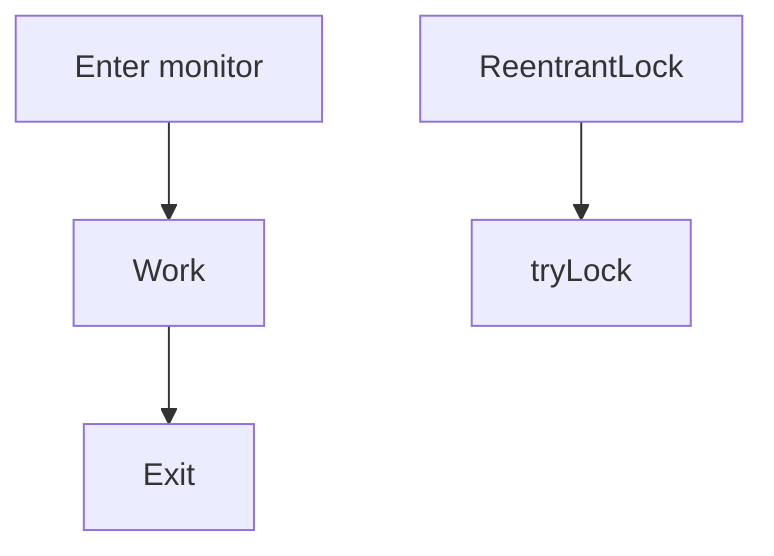

# synchronized and Lock

Java · 20 min

Both exclude other threads. Lock can try, time out, and unlock in a different shape. synchronized is the default.

## Flow



## synchronized and Lock

synchronized on a private final object, not on a public one a caller can lock. Wait and notify belong to that monitor. ReentrantLock needs unlock in a finally. tryLock is how you refuse to wait. ReadWriteLock fits a map that is mostly read. Fair locks are slower. You rarely need them. Prefer the java.util.concurrent class that already encodes the protocol, such as a BlockingQueue, before you invent a condition.

## Play this

1. Name it
2. Say the rule
3. Tie it to the project or a problem
4. One sentence from memory tomorrow

## Steps

- Read the rule once.
- Write the example from a blank file.
- Say the interview answer out loud.

## Example

```text
synchronized (guard) {
    while (!ready) guard.wait();
}
```

## The usual miss

Locking on this, or forgetting unlock.

## They will ask

When is tryLock the right call?

## Before you close the laptop

Name the object you would synchronize on for the in-memory bucket map.
