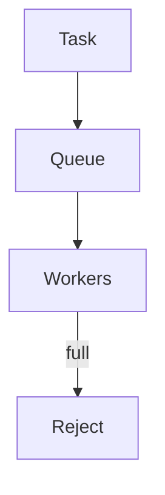

# Thread pools

Java · 20 min

A pool has a bound. The bound is the design.

## Flow



## Thread pools

newFixedThreadPool uses an unbounded queue. Under load the queue holds the heap, not the CPU. A bounded queue plus a rejection policy is the production shape. CallerRunsPolicy slows the producer. AbortPolicy fails the submit. Name the threads. Separate a pool for CPU work from a pool that blocks on HTTP or JDBC. The common ForkJoinPool is the wrong place for blocking. Size a blocking pool from the number of concurrent calls you can afford, not from the core count alone.

## Play this

1. Name it
2. Say the rule
3. Tie it to the project or a problem
4. One sentence from memory tomorrow

## Steps

- Read the rule once.
- Write the example from a blank file.
- Say the interview answer out loud.

## Example

```text
new ThreadPoolExecutor(4, 4, 0, SECONDS,
    new ArrayBlockingQueue<>(100),
    new ThreadPoolExecutor.AbortPolicy());
```

## The usual miss

Executors.newFixedThreadPool and never looking at the queue.

## They will ask

What happens when the queue is full?

## Before you close the laptop

Write the two numbers: workers and queue capacity.
