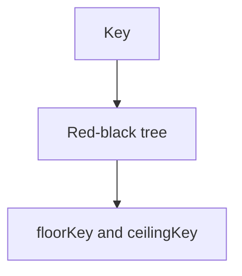

# TreeMap

Java · 20 min

TreeMap keeps keys sorted. That is the whole reason to pay log n.

## Flow



## TreeMap

TreeMap is a red-black tree. get, put, and remove are log n. firstKey, lastKey, floor, and ceiling are the operations HashMap cannot do. Keys must be comparable and the comparator must match equals. A null key is not allowed with the natural order. Use it for a time-ordered window of counts, or for a leaderboard slice. Use HashMap when order does not matter.

## Play this

1. Name it
2. Say the rule
3. Tie it to the project or a problem
4. One sentence from memory tomorrow

## Steps

- Read the rule once.
- Write the example from a blank file.
- Say the interview answer out loud.

## Example

```text
TreeMap<Integer, String> times = new TreeMap<>();
times.put(10, "a");
times.floorKey(12); // 10
```

## The usual miss

Using TreeMap for a frequency map that never asks for order.

## They will ask

Give a case where HashMap is the wrong map.

## Before you close the laptop

Name floorKey in one sentence.
