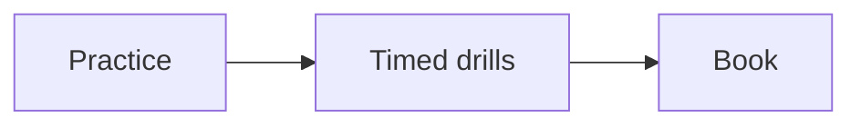

# When to book CKAD

Kubernetes · 10 min

Book the exam after you can fix a crashing pod, a bad probe, a Service selector, and a Secret without notes.

## Flow



## When to book CKAD

CKAD is performance-based: design and build, deploy, observe, configure, secure, and network. It is relevant because you want cloud-native backend work and you already touch OpenShift. It is not the course. The course is the list above, on this project. CKA is a different exam and not this winter.

## Play this

1. Name it
2. Say the rule
3. Tie it to the project or a problem
4. One sentence from memory tomorrow

## Steps

- Read the rule once.
- Write the example from a blank file.
- Say the interview answer out loud.

## Example

```text
Book after the drills, not before the first Deployment.
```

## The usual miss

Booking both CKA and CKAD this month.

## They will ask

What will you practice the week before?

## Before you close the laptop

List the four failures you can fix cold.
