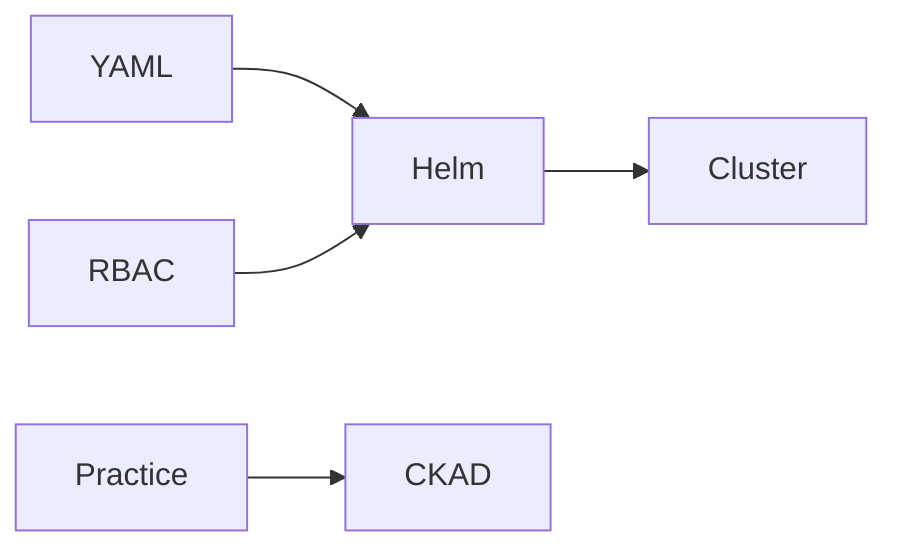

# Config, RBAC, Helm, then CKAD

Kubernetes · 30 min

You already touch OpenShift at work. The public skill is the same objects with names you can explain, then Helm to stop copying YAML, then CKAD as proof.

## Flow



## Then the exam

ConfigMap is config. Secret is a credential, still not a place for a committed password in git. RBAC limits what the agent service account can do. A volume holds a scratch disk if you need one. Helm templates the manifests so the laptop and the cluster differ by values. CKAD is a timed performance exam over these objects. Book it after you can fix a crashing pod without notes.

## Play this

1. ConfigMap for settings
2. Secret for credentials
3. RBAC is least privilege
4. CKAD after you can debug

## Steps

- A ConfigMap changes the log level without a new image.
- A Secret is not encryption by itself. You still restrict who can get secrets.
- A Role that can only get and list pods in one namespace is the agent's read identity.
- Book CKAD when you can fix a CrashLoopBackOff without notes. Not this month.

## Example

```text
kubectl logs, describe, and get events. That is the debug loop.
```

## The usual miss

cluster-admin on the agent service account.

## They will ask

The pod is CrashLoopBackOff. What do you type first?

## Before you close the laptop

Break a probe on purpose and fix it with describe.
