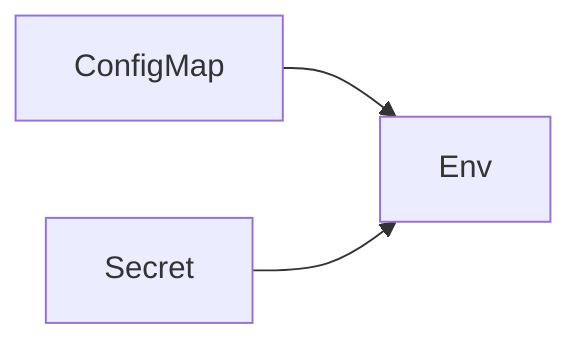

# ConfigMap and Secret

Kubernetes · 15 min

Config is a ConfigMap. A credential is a Secret. Git holds the manifest shape, not the password value.

## Flow



## ConfigMap and Secret

The database host can be a ConfigMap. The password is a Secret created out of band or by the platform. A Secret in a public git history is still a leak. Mount or inject as env. The app reads env.

## Play this

1. Name it
2. Say the rule
3. Tie it to the project or a problem
4. One sentence from memory tomorrow

## Steps

- Read the rule once.
- Write the example from a blank file.
- Say the interview answer out loud.

## Example

```text
SPRING_DATASOURCE_URL from ConfigMap. Password from Secret.
```

## The usual miss

A Secret committed next to the Deployment.

## They will ask

Which value is allowed in git?

## Before you close the laptop

Split one config value from one secret.
